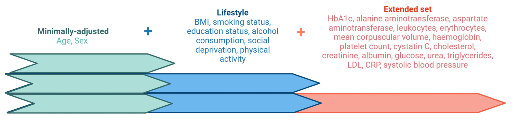

Information flows in the cell from DNA to RNA to protein. These steps interact with the environment ultimately yielding phenotype. The project of modern biology is to understand each of those steps in sufficient detail to predict future outcomes and intervene in beneficial ways, for example predicting, preventing, or curing disease.

Proteins are a critical piece of the puzzle because they are the machinery of the cell, the tiny biochemical pumps, valves, motors, and assembly lines. The genome is a library of blueprints. It gives information on potentialities and predispositions - what might happen.Proteins are a window into what's happening right now.

In recent months, a truckload of tasty research papers has been published based on data produced by a quantitative protein assay from a Swedish company called Olink. Data of this kind has recently been added to the UK Biobank's phenominal dataset. Back in a prior life, I got a preview of the impressively specific data Olink is able to generate.

Promises to help:
- better understanding of biology and disease.
- predict
- diagnose molecular subtypes.
- partition patients in responders and non-responders with respect to particular therapies
- drug discovery

## History

{:style="float: right; margin: 18px 18px 18px 18px; width: 204px; height: 85px;"}

About 6-ish years ago, in a very different world, a company called [Arivale][1001] occupied a couple floors of the Dexter Horton building in Seattle. Arivale's premise was to monitor human health like [aerospace engineers monitor airliner engines][7]. I rotated through roles in software engineering and research, finding positive energy everywhere.

The company wasn't destined to make it off the runway, but the hope was that gathering [personal, dense, dynamic data clouds][9] from genetics, blood, saliva and microbiome at multiple time points would allow each participant to be an n-of-1 experiment in healthier living. Arivale was just one of many [personalized health startups](/2018-08-24/data-health-tech-companies.html) of that era. Cynics called it an expensive way to tell people to eat right and exercise and they weren't wrong. But, we did assemble a very rich data set and the research team did some nice work.

The Arivale cohort contained lots of boringly healthy people. Good on 'em, but it's the sick data points that are the informative ones. More valuable still are the rare glimpses that show the transition from wellness to disease. Arivale scientists caught a few of those elusive data points using proteomics technology from Olink. In 2020, after Arivale's demise, they published [Untargeted longitudinal analysis of a wellness cohort identifies markers of metastatic cancer years prior to diagnosis][2].

[{:style="width: 80%; margin: 1em 4em; filter: drop-shadow(0.35rem 0.35rem 0.4rem rgba(0, 0, 0, 0.5));"}][2]

While the _n_ was small, the findings hint that you might be able to see a cancer diagnosis coming months or years in advance.

<figure>
    
    <figcaption style="font-size: small; font-style: italic;">“Longitudinal trajectories of selected outlier proteins across multiple cancer types in individuals. Plus (+) signs indicate the diagnosis date (if applicable) for that disease trajectory. Y-axis values are median absolute deviation (MAD). Unlabeled trajectories (grey lines) represent trajectories for all other samples in the study for that protein. (a) CEACAM5 was a persistent outlier in pre-diagnosis samples for two metastatic cancer individuals (lung and pancreatic) and exhibited rapid change to extreme outlier levels for metastatic breast cancer. One undiagnosed individual with skin lesions also exhibited elevated levels and fluctuating outlier status for CEACAM5. (b) CALCA was a persistent outlier in metastatic pancreatic cancer. (c) DLK1 was a persistent outlier in metastatic pancreatic cancer. (d) ERBB2 rapidly increased from low levels to outlier levels over a period of six months preceding the diagnosis of metastatic breast cancer.”
    </figcaption>
</figure>

Notably, the outlier proteins have very plausible links to cancer:

- [CEACAM5][8] functions in cell-cell adhesion and has known association with cancer.
- [DLK1][14] has a role as a regulator of cell growth and neuroendocrine differentiation.
- [ERBB2][15] is a synonym for HER2, a human epidermal growth factor receptor that promotes cell growth and is often overactive in breast cancer.
- Splice variants of [CALCA][17] code for peptide hormones calcitonin, CGRP, and katacalcin involved in stimulating vasodilation and angiogenesis.

## Olink

{:style="float: right; margin: 18px 18px 18px 18px; width: 204px; height: 85px;"}

[Olink][16] calls it's proteomic technology [PEA for proximity extension assay][4]. (Extra points for the Gregor Mendel reference.) The company spun out of Ulf Landegren's lab at Uppsala University.

Olink's method works by growing up a pair of different antibodies to a particular target and binding each antibody with an DNA oligonucleotide. The two oligo's are complimentary, so if both antibodies bind, the strands anneal and you have a double-stranded DNA bar code. Amplifying and reading those bar codes results in a quantitative measure of relative abundance.

{:style="margin: 1em 2em 1em 0em; width: 33%; float: left;"}

Affinity-based proteomics is expensive, but cheaper than mass-spectrometry. The catch is you have to know what you're looking for.

In the old days there were 15 panels of 96 proteins per panel, focusing on functional categories like cardiovascular, immunity, oncology, neurology, inflammation, and metabolism. The UK Biobank used a newer generation, Olink Explore 3072, to measure 2,923 unique proteins.

This past year, Thermo Fisher acquired Olink for $3.1 billion. The transaction completed in July 2024.

## UK Biobank

The UK Biobank is one of the most valuable research datasets in human biology. The project began registering participants in 2006 and since that time has collected from 500,000 volunteers data on genetics, medical history, activity, lifestyle, nutrition, clinical labs, and imaging.

The UK Biobank is an effort whose scale and duration will not easily be replicated. It owes its existence to a lucky combination of farsighted private and government funders, and a centralized healthcare system. As Arivale demonstrated, building a multi-omic data set with venture capital is tricky. Even with the benefit of Google's deep pockets, Verily has signed on as a [partner in All of Us][404]. The size of the cohort, data across multiple dimensions, and generous access for researchers make the UK Biobank a [globally important resource][301].

### UKB-PPP

[{:style="margin: 1em 0em 1em 2em; width: 80%;"}][501]

The UKB-PPP (Pharma Proteomics Project) is a precompetitive consortium of 13 biopharmaceutical companies funding the generation of multiplex, population-scale proteomic data using Olink's proteomic assay technology. The paper that announces the dataset, [Plasma proteomic associations with genetics and health in the UK Biobank][10] by Sun and Whelan et al. describes the dataset like this:

> “We conducted proteomic profiling on blood plasma samples collected from 54,219 UKB participants using the antibody-based Olink Explore 3072 PEA, measuring 2,941 protein analytes and capturing 2,923 unique proteins. This included a randomly selected subset of 46,595 UKB participants at the baseline visit (randomly selected baseline), 6,376 individuals at baseline selected by the UKB-PPP consortium members (consortium selected) and 1,268 individuals who participated in the COVID-19 repeat-imaging study at multiple visits.”

One imagines pharma operatives sitting around in a smoke-filled room negotiating their selections like some strange kind of baseball draft. Maybe it's interesting that the study population is enriched for lupus, Parkinson's, pulmonary heart disease, spinal muscular atrophy, interstitial pulmonary disease, and renal failure. I'd like to see how the drug developers will take this data, relate it to genomics and biochemical pathways, enrich it with their own private research, and inform their thinking about potential drug targets and candidate molecules.

I looked for the per-sample costs, but couldn't find a dollar figure. Budget information may not be public, but it can't have come cheaply. It's amazing that this dataset is available. The sponsoring companies are:

- Alnylam,
- Amgen
- AstraZeneca
- Biogen
- Bristol Myers Squibb
- Calico
- Genentech/Roche Group
- GSK
- The Janssen Pharmaceutical Companies of Johnson & Johnson
- Novo Nordisk
- Pfizer
- Regeneron
- Takeda.

Press blurbs about the UKB-PPP project:

- [UK Biobank launches one of the largest scientific studies measuring circulating proteins, to better understand the link between genetics and human disease][501] (Dec 2020)
- [Largest dataset of thousands of proteins marks landmark step for research into human health][502] (Oct 2023)

## Papers

The paper [Plasma proteomic associations with genetics and health in the UK Biobank][10] (Sun & Whelan et al, Nature, October 2023), quoted above, describes the dataset and explores the gene-to-protein step.

“plasma proteomic measures can infer age, sex, BMI, blood groups, and renal and liver function with high predictive accuracy” [[Sun et al][10]]

- UK Biobank PPP
  - insight into the biology of aging and disease
  - risk prediction
  - drug targets

Largest dataset of thousands of proteins marks landmark step for research into human health
https://www.ukbiobank.ac.uk/learn-more-about-uk-biobank/news/dataset-of-thousands-of-proteins-marks-landmark-step-for-research-into-human-health

{:style="width: 80%; margin: 1em 4em; filter: drop-shadow(0.35rem 0.35rem 0.4rem rgba(0, 0, 0, 0.5));"}

from 54,219 UKB participants using the antibody-based Olink Explore 3072 PEA, measuring 2,941 protein analytes and capturing 2,923 unique proteins

- research papers
  - genetics
  - disease
    - cancer
  - aging

### Genetics

Proteomics is shedding light on the linkage between a genetic variant and a biological process, on the steps between DNA and phenotype. Protein quantitative trait loci, pQTLs, are locations on the genome associated with variations in protein expression.

The promise of population-scale proteomics is to build a bridge between genetic variants and biological process. The intermediate steps might be inferred through observing changes in levels of proteins detectable in blood plasma. GWAS finds association between genetic variants and traits of interest. Finding pQTLs starts to fill in the causal picture where before there was only association, thus distinguishing between variants that are involved with disease and those that are merely correlated.

mendelian randomization

### Disease

{:style="width: 80%; margin: 1em 4em; filter: drop-shadow(0.35rem 0.35rem 0.4rem rgba(0, 0, 0, 0.5));"}

[Blood protein assessment of leading incident diseases and mortality in the UK][11] Gadd et al, Nature Aging, 2024

[Blood proteins predict the risk of many diseases years before onset][18]
https://www.nature.com/articles/s41591-024-03145-w

{:style="width: 80%; margin: 1em 4em; filter: drop-shadow(0.35rem 0.35rem 0.4rem rgba(0, 0, 0, 0.5));"}

### Cancer

[Identifying proteomic risk factors for cancer][1]
Keren Papier et al 15 May 2024

{:style="width: 80%; margin: 1em 4em; filter: drop-shadow(0.35rem 0.35rem 0.4rem rgba(0, 0, 0, 0.5));"}

{:style="margin: 1em 0em 1em 2em; width: 20%;"}

“However, new multiplex proteomics methods allow for the simultaneous measurement of thousands of proteins, many of which have not previously been assessed for their associations with risk across multiple cancer sites.“

44,645 UK Biobank participants
4921 incident malignant cancer cases

Next generation pan-cancer blood proteome profiling using proximity extension assay
https://www.ncbi.nlm.nih.gov/pmc/articles/PMC10354027/

#### Breast Cancer

Given the costs of breast screening programs, in dollars and unfun procedures, the world could really use a very smart model to guide screening and further workup to where provide most benefit. Imagine feeding in to such a model images, clinical labs, genome, proteins, cell-free dna, and whatever else we can throw at it. Gears spin and out pops a risk profile that might inform when you get your next screening or whether you want to move on to biopsy.

With this in mind, I was disappointed to see the small lift in predictive ability for breast cancer. It's better when the data speaks loud-and-clear without statistical jiggery-pokery, but could a more sophisticated model pull out a stronger signal? That's the question addressed in this paper:

{:style="width: 80%; margin: 1em 4em; filter: drop-shadow(0.35rem 0.35rem 0.4rem rgba(0, 0, 0, 0.5));"}

[Evaluation of circulating plasma proteins in breast cancer using Mendelian randomisation][12] Mälarstig et al, Nature Communications, 2023

Using a technique called [Mendelian randomization][], they find five circulating proteins that pass statistical tests and have plausible indications of involvement with breast cancer.

#### Lung Cancer

{:style="width: 80%; margin: 1em 4em; filter: drop-shadow(0.35rem 0.35rem 0.4rem rgba(0, 0, 0, 0.5));"}

The blood proteome of imminent lung cancer diagnosis
https://www.nature.com/articles/s41467-023-37979-8

This is from a different data set, but I include it for two reasons. First, because lung cancer is one of the disease areas where circulating proteins are most informative. Also, because the figure itself is highly informative. Some thought and care went into creating this figure and I appreciate that.

### Aging

Proteomic aging clock predicts mortality and risk of common age-related diseases in diverse populations
Argentieri et al, Nature Medicine, 2024

{:style="width: 80%; margin: 1em 4em; filter: drop-shadow(0.35rem 0.35rem 0.4rem rgba(0, 0, 0, 0.5));"}

## Closing thoughts

Other players with different technologies include SomaLogic, Nautilus Biotechnology
aptamers vs antibodies
See this [2020 analysis of the proteomics space from a VC point of view][904].

Similar to cell-free nucleic acid

How used? predictive vs diagnostic

medical system doesn't make great use of predictive information

Limitations: some diseases have more reason to affect blood proteins than others. 

Arivale vision still in future

- Next steps
  - multiple time points - diff within and individual
  - model the combines images, genome, proteins, cell-free dna, standard clinical labs, outputs when to get your next screening mammogram.

Mapping biological influences on the human plasma proteome beyond the genome
Carrasco-Zanini et al, Nature Metabolism, 2024

Large-scale plasma proteomics comparisons through genetics and disease associations
https://www.nature.com/articles/s41586-023-06563-x

As a clinical test, taking a vial of blood is much less unpleasant than tissue biopsy.

[Cell-free DNA analysis in current cancer clinical trials: a review][903]

## References

- [UK Biobank: a globally important resource for cancer research][301]
- [Cell-free DNA analysis in current cancer clinical trials: a review][903]
- [Genetics meets proteomics: perspectives for large population-based studies] Suhre et al. 2020 nature reviews genetics 

[1]: https://www.nature.com/articles/s41467-024-48017-6
[2]: https://www.nature.com/articles/s41598-020-73451-z
[3]: https://www.biorxiv.org/content/10.1101/2022.05.02.490328v3
[4]: https://olink.com/our-platform/our-pea-technology/
[5]: https://olink.com/technology/pea-technology-video
[6]: https://olink.com/
[7]: https://jamanetwork.com/journals/jama/article-abstract/2715165
[8]: https://www.uniprot.org/uniprotkb/P06731/entry
[9]: https://www.ncbi.nlm.nih.gov/pmc/articles/PMC5568837/
[10]: https://www.nature.com/articles/s41586-023-06592-6
[11]: https://www.nature.com/articles/s43587-024-00655-7
[12]: https://www.nature.com/articles/s41467-023-43485-8
[13]: https://www.nature.com/articles/s42255-024-01133-5
[14]: https://www.genecards.org/cgi-bin/carddisp.pl?gene=DLK1
[15]: https://www.uniprot.org/uniprotkb/P04626/entry
[16]: https://olink.com/
[17]: https://www.genecards.org/cgi-bin/carddisp.pl?gene=CALCA
[18]: https://www.nature.com/articles/s41591-024-03145-w

[201]: https://www.khanacademy.org/science/ap-biology/gene-expression-and-regulation/translation/a/intro-to-gene-expression-central-dogma
[202]: https://www.msdmanuals.com/home/fundamentals/genetics/genes-and-chromosomes

[301]: https://www.nature.com/articles/s41416-022-02053-5

[401]: https://www.projectbaseline.com/
[402]: https://allofus.nih.gov/
[403]: https://www.ukbiobank.ac.uk/
[404]: https://verily.com/perspectives/powering-all-of-us-with-the-nih-vanderbilt-university-and-the-broad-institute

[501]: https://www.ukbiobank.ac.uk/learn-more-about-uk-biobank/news/uk-biobank-launches-one-of-the-largest-scientific-studies
[502]: https://www.ukbiobank.ac.uk/learn-more-about-uk-biobank/news/dataset-of-thousands-of-proteins-marks-landmark-step-for-research-into-human-health

[901]: https://www.resolutionbio.com/
[902]: https://grail.com/
[903]: https://www.nature.com/articles/s41416-021-01696-0
[904]: https://axial.substack.com/p/axial-discovery-olink-and-proteomics

[1001]: https://cbare.github.io/2019-05-31/multi-omic-studies.html