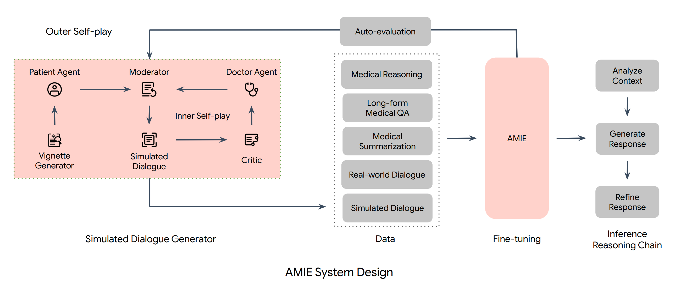

“[Towards Conversational Diagnostic AI][1]” is a great piece of work published by a group from Google led by Alan Karthikesalingam and Vivek Natarajan. It starts off like this:

{:style="width: 80%; margin: 1em 4em; filter: drop-shadow(0.35rem 0.35rem 0.4rem rgba(0, 0, 0, 0.5));"}

> “At the heart of medicine lies the physician-patient dialogue, where skillful history-taking paves the way for accurate diagnosis, effective management, and enduring trust.”

Part of why I found this so interesting is that they've taken on a problem with which I have some history. In the pre-LLM world of 2019, at a telemedicine startup called [98point6][301], I worked on “question-bot” whose modest goal was to automate the primary care patient interview. So, I was interested to see how you would approach the same problem with a new set of tools.

Note that this paper was published in very early 2024 based on Palm2, Google's flagship LLM prior to the release of Gemini - so, a couple iterations behind the LLMs of late 2024. The paper describes AMIE, a frontier model fine-tuned for medical dialog.

## Inner and outer training loops

The fine-tuning strategy is modeled on self-play, which is how DeepMind trained the model that [beat the world champion go player][]. The design has an inner loop in which novel clinical scenarios or vignettes are assembled using "search" and used to generate new patient-doctor dialogs.

In the inner loop, we have agents asked to play the role of patient, doctor, and critic. The patient and doctor engage in dialog to elicit symptoms, arrive at a differential diagnosis, and devise a care-plan. The critic provides feedback on the dialog and suggests ways it could be improved. All agents are AMIE with different prompts.

The inner loop of generation and reflection feeds into the outer loop of fine-tuning, which the paper describes as follows:

> “AMIE is a conversational medical AI optimised for diagnostic dialogue. AMIE is instruction fine-tuned with a combination of real-world and simulated medical dialogues, alongside a diverse set of medical reasoning, question answering, and summarization datasets. Notably, we designed a self-play based simulated dialogue environment with automated feedback mechanisms to scale AMIE’s capabilities across various medical contexts and specialities. Specifically, this iterative self-improvement process consisted of two self-play loops: (1) An “inner” self-play loop, where AMIE leveraged in-context critic feedback to refine its behavior on simulated conversations with an AI patient agent; (2) An “outer” self-play loop where the set of refined simulated dialogues were incorporated into subsequent fine-tuning iterations. During online inference, AMIE used a chain-of-reasoning strategy to progressively refine its response conditioned on the current conversation to arrive at an accurate and grounded reply to the patient in each dialogue turn.”

## Evaluation

As language models get more advanced, evaluation converges toward the way humans evaluate each other. In this case, the inspiration was a standardized evaluation framework used to assess medical professionals in the UK, Canada, and Australia, adapted to a text-only primary care interview.

> “We designed and conducted a blinded remote Objective Structured Clinical Examination (OSCE) with validated simulated patient actors interacting with AMIE or Primary Care Physicians (PCPs) via a text interface. Across multiple axes corresponding to both specialist physician (28 out of 32) and patient actor (24 out of 26) perspective, AMIE was rated as superior to PCPs while being non-inferior on the rest.”

The scoring system used in the paper has 6 axes, with three focusing on patient-centered aspects and three focused on clinical aspects.

{:style="width: 66%; margin: 1em 4em;"}

## How effective is the inner loop?

Privacy concerns and the tendency of LLMs to memorize and regurgitate their training data put constraints on direct use of real world data. Generating and refining synthetic dialogs is a creative strategy to squeeze maximal benefit from a small set of high-quality data. How well does it work?

Looks to me like there is some lift from self-critique, but it's limited. I'm guessing this is because the model is grading own howework. In contrast, a game provides ground-truth about who played a better game. In RLHF, the human preferences are new information. In this scenario, there's not really a source of new information, except maybe the grading rubric. Given a that, the model can learn by reflection which of its own outputs is more aligned with the rubric and thus learn to prefer those outputs over others.

The lesson here is to look for sources of ground truth or new information that can be injected into the process at every iteration.

### Acting under uncertainty

Computer science and medicine differ in their approach to uncertainy. Traditional computer science traffics in the discrete, logical, and binary. In contrast, a medical practitioner is swimming in uncertainty all the time and must act urgently without full information. One of the reasons that machine learning is hard is that ML forces CS people to deal with uncertainty and reason probabilistically.

Differential diagnosis is a ranked list of possible causes for a set of observed symptoms. A physician might mentally assign a qualitative probability to each and in considering next steps will weight severity, urgency, available diagnostic tests and their costs and invasiveness to the patient.

## Conclusion

People worry that the internet is being pumped full of AI generated junk content and future generations of models trained on that will be progressively degraded. The inner loop demonstates that a small but non-zero benefit can be had by selectively filtering and refining synthetic training data. So, perhaps all is not lost.

The iterative improvement is a powerful idea. The lesson is that each iteration needs to add new information. How would collection of ground truth be engineered in the context of medical dialog? Whether the model get's it right or wrong, both paths need to be instrumented and data collected. That feedback has to come from a human-in-the-loop, in this case a medical doctor. I can see organizations like the Mayo Clinic or Kaiser pulling that off more than I can imagine Google doing it.

How would you go about designing a process that throws off the right kind of training data to create a self-improving learning loop?

## More

Just a few months later, Google returns with a new multimodel base model, Gemini

- [Capabilities of Gemini Models in Medicine][3], April 2024
- [Advancing Multimodal Medical Capabilities of Gemini][4], May 2024

For more on the paper, check out the interview with two of the authors on the Cognitive Revolution podcast from June of 2024 [The AI Doctor Can See You Now, with Vivek Natarajan and Khaled Saab from Google][2].

[1]: https://arxiv.org/abs/2401.05654
[2]: https://www.cognitiverevolution.ai/the-ai-doctor-can-see-you-now-with-vivek-natarajan-and-khaled-saab-from-google/
[3]: https://arxiv.org/abs/2404.18416
[4]: https://arxiv.org/abs/2405.03162

[301]: https://www.98point6.com/
