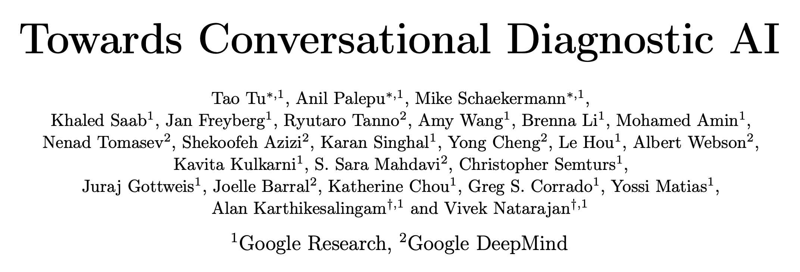
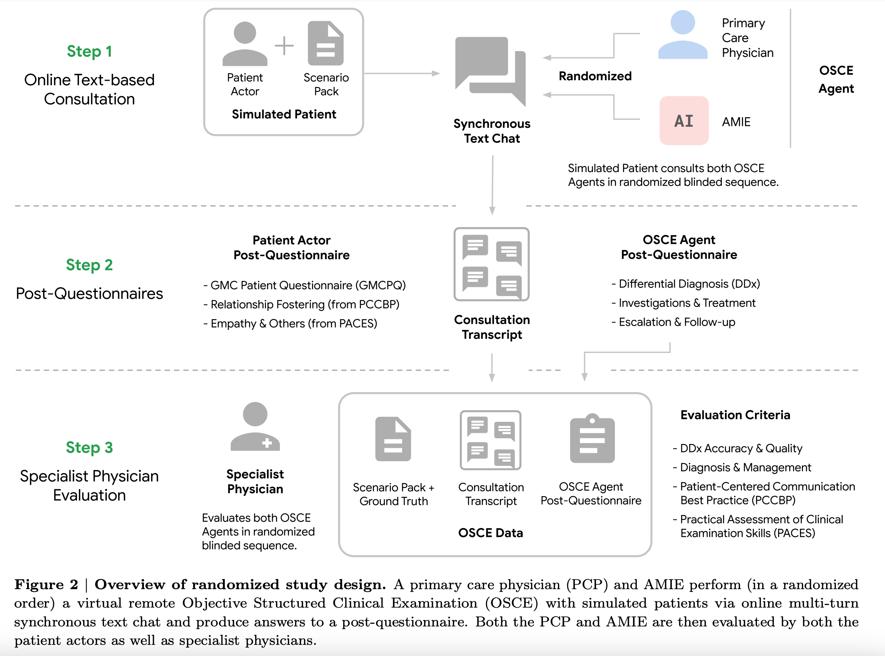
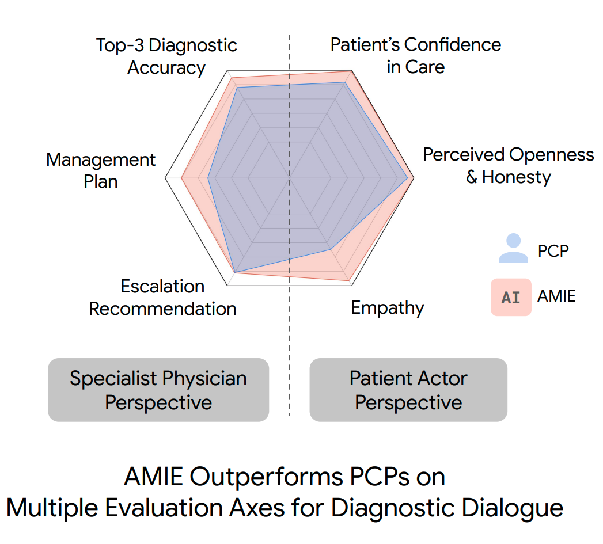
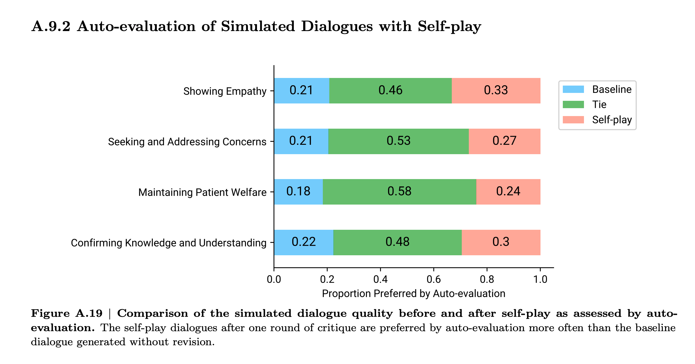

“[Towards Conversational Diagnostic AI][1]” is a great piece of work published by a group from Google led by Alan Karthikesalingam and Vivek Natarajan. It starts off like this:

{:style="width: 80%; margin: 1em 4em; filter: drop-shadow(0.35rem 0.35rem 0.4rem rgba(0, 0, 0, 0.5));"}

> “At the heart of medicine lies the physician-patient dialogue, where skillful history-taking paves the way for accurate diagnosis, effective management, and enduring trust.”

Part of why I found this so interesting is that they've taken on a problem with which I have some history. In the pre-LLM world of 2019, at a telemedicine startup called [98point6][301], I worked on a project affectionately known as “question-bot” whose modest goal was to automate the primary care patient interview. So, I was interested to see how you would approach the same problem with a new set of tools.

Note that this work was published in very early 2024, and based on Palm2, Google's flagship LLM prior to the release of Gemini - so, a couple iterations behind the LLMs of late 2024.

## Inner and outer training loops

Modeled on self-play, which is the strategy with which [DeepMind beat the world champion go player][].

In the inner loop, we have agents asked to play the role of patient, doctor, and critic. The patient and doctor engage in dialog to elicit symptoms, arrive at a differential diagnosis, and devise a care-plan. The critic provides feedback on the dialog and suggests ways it could be improved.

The outer loop consists of instruction fine-tuning.

> “AMIE is a conversational medical AI optimised for diagnostic dialogue. AMIE is instruction fine-tuned with a combination of real-world and simulated medical dialogues, alongside a diverse set of medical reasoning, question answering, and summarization datasets. Notably, we designed a self-play based simulated dialogue environment with automated feedback mechanisms to scale AMIE’s capabilities across various medical contexts and specialities. Specifically, this iterative self-improvement process consisted of two self-play loops: (1) An “inner” self-play loop, where AMIE leveraged in-context critic feedback to refine its behavior on simulated conversations with an AI patient agent; (2) An “outer” self-play loop where the set of refined simulated dialogues were incorporated into subsequent fine-tuning iterations. During online inference, AMIE used a chain-of-reasoning strategy to progressively refine its response conditioned on the current conversation to arrive at an accurate and grounded reply to the patient in each dialogue turn.”

## Evaluation

As language models get more advanced, evaluation comes to resemble the way humans evaluate each other.

> “We designed and conducted a blinded remote Objective Structured Clinical Examination (OSCE) with validated simulated patient actors interacting with AMIE or Primary Care Physicians (PCPs) via a text interface. Across multiple axes corresponding to both specialist physician (28 out of 32) and patient actor (24 out of 26) perspective, AMIE was rated as superior to PCPs while being non-inferior on the rest.”

{:style="width: 66%; margin: 1em 4em;"}

### Acting under uncertainty

Disciplines nurture a certain mindset. One of the more pervasive differences between computer science and medicine is the approach to uncertainy. Tradition computer science does not traffic in uncertainty. Our structures are discrete, logical, and binary. A medical practitioner is swimming in uncertainty every day and must act urgently without full information.

One of the reasons that machine learning is hard is that ML forces CS people to deal with uncertainty and reason probabilistically.

Differential diagnosis is a ranked list of possible causes for a set of observed symptoms. A physician might mentally assign a qualitative probability to each and in considering next steps will weight severity, urgency, available diagnostic tests and their costs and invasiveness to the patient.

## How effective is the inner loop?

Filtering

Being trained on the whole internet, LLMs have seen examples of good behavior and bad. If the model is given a rubric, it can self-reflect and judge which of its own outputs is more aligned with the rubric and thus learn to prefer the good behavior over the bad.

Looks to me like a marginal improvement. I'm guessing this is because there's not really a source of new information. The model is grading own howework. In contrast, a game provides ground-truth feedback that is missing in this process. In RLHF, the human preferences are new information.

The lesson here is to look for sources of new information, preferrably ground truth, and incorporate those into your data gathering and training processes.

## Conclusion

The work on evaluation is really strong. The technique of iterative improvement is a good one. The lesson is that each iteration needs to add new information.

[Capabilities of Gemini Models in Medicine][3], April 2024, is the next work from this group.

The Cognitive Revolution podcast from June of 2024 [The AI Doctor Can See You Now, with Vivek Natarajan and Khaled Saab from Google][2]

[1]: https://arxiv.org/abs/2401.05654
[2]: https://www.cognitiverevolution.ai/the-ai-doctor-can-see-you-now-with-vivek-natarajan-and-khaled-saab-from-google/
[3]: https://arxiv.org/abs/2404.18416

[301]: https://www.98point6.com/
