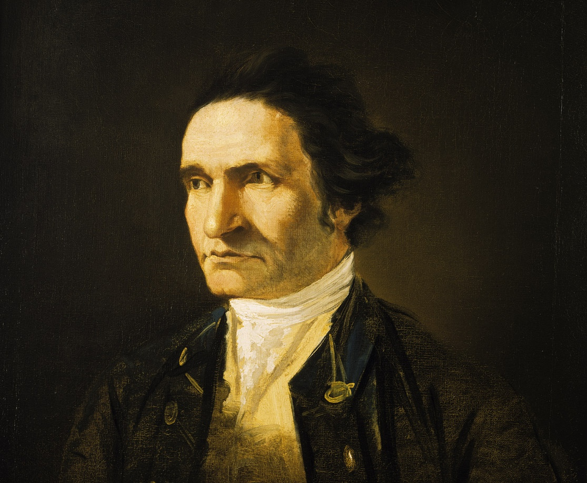
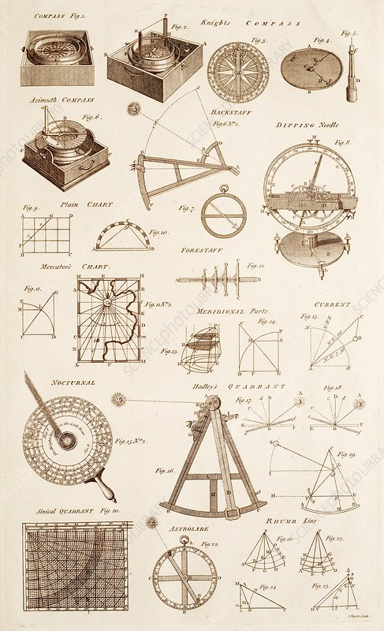
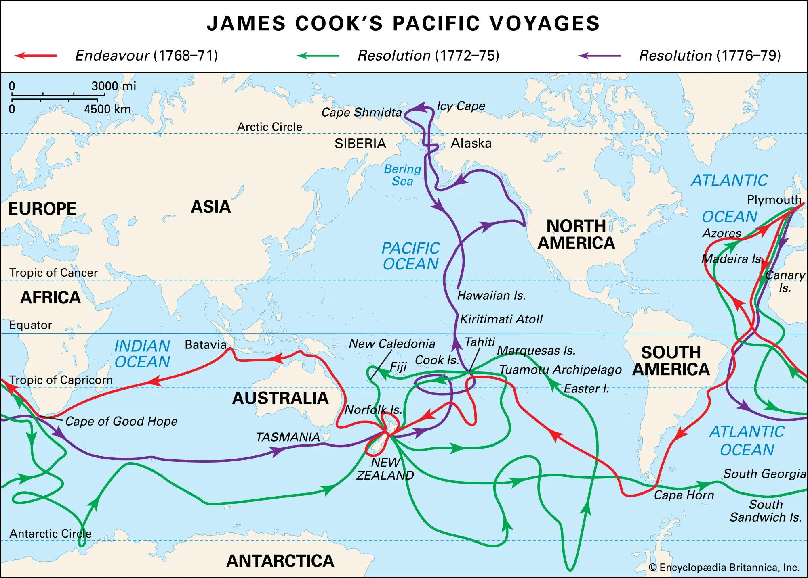
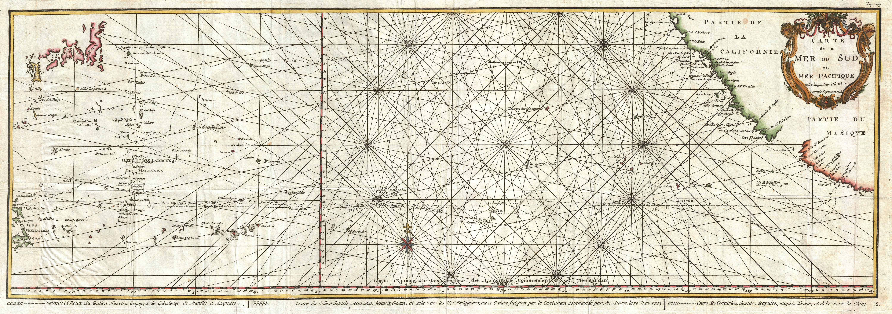
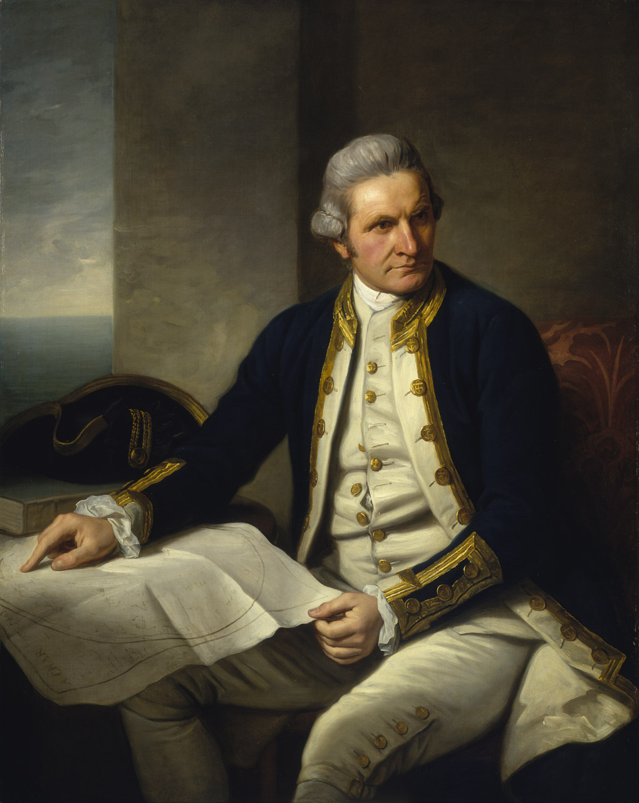

Captain James Cook was described as, “A grave, steady man,” by lawyer and author James Boswell. Cook trained under Quakers and “had by all accounts absorbed their values - temperance, frugality, modesty, truthfulness, a ferocious work ethic, and a disdain for arrogance and ostentation.”

[_The Wide Wide Sea: Imperial Ambition, First Contact and the Fateful Final Voyage of Captain James Cook_][1] by Hampton Sides is the story of Cook's third voyage. It's a travelogue of adventures through harrowing storms and seductive tropical paradises, but also the story of an extremely capable man starting to decline in middle age and a re-examination of the plagues and misfortunes visited upon unsuspecting locals by the arrival of Europeans. _The Wide Wide Sea_ made many lists of the best books of 2024 and I thoroughly enjoyed it, not least because the itinerary hits several far-flung places in the world where I've spent time.

{:style="float: right; margin: 1em 0 1em 1em; width: 42%"}

Cook got his start as a skilled surveyor and marine chart maker, in other words, he was a technician with the emerging technologies of the day. To an 18th century explorer, the tools of the trade were sailing ships, charts, compass, sextant, trigonometry, and, on Cook’s third voyage, the first marine chronograph for determining longitude. Equally important was Cook's insistence on shipboard hygiene and healthy diet. The role of Vitamin C was unknown at the time, but eating cress, sauerkraut, and orange extract helped the crew stave off scurvy.

These technologies, along with firearms, formed the basis for the interlinked enterprises of global exploration, commerce, colony, and empire. On Cook’s voyage was an experiment in globalization with decidedy mixed results. There are beautiful moments of first contact, as when the Mowachaht people of Nootka Sound sing in greeting to the sailors who then break out horns to reply with songs of their own. In Alaska, Cook's men performed a flag-planting ceremony to make an absurd claim of possession on behalf of the Crown while indigenous warriors watched suspiciously. These warriors might well have fought and overwhelmed the Europeans. This raises the question: should they have? This episode ends without violence, but the Europeans, fearful of just such a reaction, too often display a jumpy readiness at the trigger.

One goal of the voyage was to resettle the native polynesian Mai, who had traveled to England aboard the HMS Adventure and spent three years making himself popular in British society. To accompany Mai, King George sent plants and livestock intended to improve the lives of the islanders. The true mission, which was to be kept secret until the ships reached Tahiti, was to search for the Western entrance to the fabled North-West Passage.

<figure style="width: 94%">
    
    <figcaption style="font-size: small; font-style: italic;">Portrait of Omai, a South Sea Islander who travelled to England with the second expedition of Captain Cook – Sir Joshua Reynolds, 1776</figcaption>
</figure>

In the islands of the Pacific, we see Cook as a budding amateur anthropologist, witnessing Tahitian pre-battle rites and documenting indigenous peoples in his diary. In the process of visiting New Zealand, Tahita, and Hawaii, Cook begins to appreciate the epic scale of the Polynesian migration.

<figure style="width: 94%">
    
    <figcaption style="font-size: small; font-style: italic;">View of Maitavie Bay, Otaheite by William Hodges, 1776</figcaption>
</figure>

<figure style="width: 94%">
    
    <figcaption style="font-size: small; font-style: italic;">Views of the South Seas No. 3 by John Cleveley the Younger</figcaption>
</figure>

The book has its share of cerulean harbors overhung with tropical greenery, but generally avoids romanticizing life at sea, not omitting the rats and cockroaches infesting the ships, the meals of rotting, wormy hard-tack, outbreaks of disease resulting from trysts with island girls. The ships, in constant need of repair, are like floating cities, complete with carpenters and blacksmiths to rebuild damaged masts and hulls. The natural resources plundered for provisions and raw material foreshadows the extractive nature of colonial exploitation.

Sides suggests that Cook, himself, was not at his best during his third voyage. Cook fails to inspect the workmanship done to refit the Resolution. The caulking is done so poorly that the ship leaks like a sieve. Cook makes tactical blunders, keeps a slightly paranoid level of secrecy, and has fits of uncontrolled temper. In Hawaii, he makes a fatal error in judgment. Cook is such a reticent character that we never learn whether he was aware of this diminishing or what might have been its cause.

<figure style="width: 94%">
    
    <figcaption style="font-size: small; font-style: italic;">Kalaniopuu welcomes Cook by Herb Kawainui Kāne</figcaption>
</figure>

Sides meets head-on the controversy surrounding the colonial merchantile project and shows that reservations we have today have existed from the start. Cook’s expeditions were part of a system, a structure of financing, technology, and skilled practitioners organized into roles, and in turn a component in the larger economic and geopolitical system of great power competition. Cook's travels are being critically reappraised in light of the ambiguous legacy left behind by receding colonial ambitions. But, that doesn't change the fact these voyages embody an irrepressible instinct to explore that is universally human.

## The Voyages of Captain Cook

### First Voyage 1768 to 1771

- HMS Endeavour
- Tahiti via Cape Horn
- New Zealand October 1769
- Australia
- Batavia
- Cape of Good Hope
- Return to England in 1771

### Second Voyage 1772 to 1775

- HMS Resolution and Adventure
- Circumnavigated of New Zealand
- Mapped East coast of Australia
- Visited Easter Island, the Marquesas, Tahiti, the Society Islands, Niue, the Tonga Islands, the New Hebrides, New Caledonia, Norfolk Island, Palmerston Island, South Sandwich Islands, and South Georgia

### Third Voyage 1776 to 1780

- HMS Resolution, commanded by Cook, and HMS Discovery commanded by Charles Clerke
- Tenerife and Cape Town,
- Tasmania
- New Zealand
- Hawaii
- Mapped the North American coast through the Bering Strait

I was surprised to learn that the search for the North-West Passage was still a live issue at this time, at least in some minds. This is over 160 years after Henry Hudson's exploration into the Hudson Bay with the same aim ended in disaster. Daines Barrington advocated the theory of a navigable Arctic Ocean and that a passage might be found by starting from the Pacific side. With the support of John Montagu, Earl of Sandwich and Lord of the Admiralty, along with botanist Joseph Banks, the British admiralty began planning a mission to make the attempt. The original choice to lead the mission was Charles Clerke, a veteran of prior Cook expeditions, until Cook came out of retirement to take command himself. Officers included William Bligh, who would later suffer mutiny during his command of the HMS Bounty and George Vancouver, who would return to the Pacific Northwest in 1791.

<figure style="float: left; margin: 1em 1em 1em 0em; width: 44%">
    
    <figcaption style="font-size: small; font-style: italic;">Portrait of William Bligh, in master’s uniform c. 1776 by John Webber</figcaption>
</figure>

<figure style="float: right; margin: 1em 0 1em 1em; width: 46%">
    
    <figcaption style="font-size: small; font-style: italic;">Captain George Vancouver, London Royal Wax Museum in Victoria, British Columbia</figcaption>
</figure>

## Historical Context

The political climate early in the 18th century is one of competition between European powers for colonial expansion. Spain was extracting tons of silver and gold from its colonies in Central and South America. France, arguably the strongest power on the European continent, occupied the St. Lawrence river in Eastern Canada and had forts stretching in an arc along the Ohio and Mississippi rivers down to New Orleans. Sugar plantations in the Caribbean were a major source of revenue. The Dutch were long established in Batavia (Indonesia) while New Amsterdam had been taken by the British a century earlier.

The Seven Years War (1756-1763), also known as the French and Indian War, stripped France of its possessions on the North American continent. William Pitt the Elder masterminded what is often referred to as the first global war, components of which were fought in America, Europe, and India. During this conflict, James Cook helped map the St. Lawrence river.

The Spanish, meanwhile, considered the Pacific their own. The Galleon trade between Manila and Acapulco had been in operation for over a century. The chart below from 1751 shows a group of Islands at the same latitude as the Hawaiian Islands, but too far east. The southernmost and largest island was named “La
Mesa” (the table), which seems to point to Hawaii. Nearby were “La Desgraciada” (the unfortunate), possibly Maui, and three smaller islands labeled “Los Mojas” which might be a screwed up version of “Los Monjes” (the monks), which could be Kahoolawe, Lanai and Molokai.

- 1519 to 1522: Magellan expedition in which Malay Enrique of Malacca may have became the first person to make a trip around the world
- 1519 to 1521: Hernando Cortés defeats the Aztecs
- 1532: Francisco Pizarro defeats the Inca
- 1577 to 1580: Francis Drake's circumnavigation
- 1565 to 1815: Manila Galleon Trade route in operation
- 1609: Henry Hudson, sailing for the Dutch East India Company, “discovers” what later becomes New York Harbor
- 1624: Dutch colonists found New Amsterdam 
- 1642: Abel Tasman reaches New Zealand
- 1664: Peter Stuyvesant, the Dutch director-general of New Netherland, surrenders the colony to the British
- 1687: Newton publishes _Principia Mathematica_
- 1712: The first shipment of coffee from Java reaches Amsterdam
- 1728: Vitus Bering discovers the Bering Strait
- 1757: Battle of Plassey: British East India Company, under the leadership of Robert Clive, defeats the Nawab of Bengal
- 1754 to 1763: The Seven Years War aka The French and Indian War
- 1756 to 1791: Life of Mozart
- 1760: George III becomes King of Britain
- 1771: Mission San Gabriel Arcángel established in California
- 1772: British East India Company takes control of Bengal 
- 1773: Bail-out of British East India Corporation
- 1774: Louis XVI (age 19) and Marie Antoinette (age 18) become King and Queen of France.
- 1775 to 1783: American Revolution
- 1776: Adam Smith publishes The Wealth of Nations
- 1776: First improved steam engines installed by James Watt
- 1781: 44 settlers arrive from from New Spain (Mexico) to found Los Angeles
- 1789: Mutiny on the Bounty
- 1789 to 1799: French Revolution
- 1791 to 1795: George Vancouver explores the Pacific Northwest
- 1803 to 1815: Napoleonic Wars
- 1805: Lewis and Clark expedition reaches the Pacific Ocean
- 1831 to 1836: Darwin's voyage on the HMS Beagle

## More

- [Book talk by Hampton Sides at Politics and Prose bookstore][2]
- [NPR Fresh Air Author Interview][6]
- [Illusions of empire: Amartya Sen on what British rule really did for India][3] by Amartya Sen, The Guardian, June 2021
- [How to kill a god: the myth of Captain Cook shows how the heroes of empire will fall][4] by Anna Della Subin, The Guardian, Jan 2022
- [The East India Company: The original corporate raiders][5] by William Dalrymple, The Guardian, March 2015
- [Timeline of Captain Cook’s third voyage][7]
- Captain George Vancouver in Alaska and the North Pacific by James K Barnett, 2017
- Madness, Betrayal and the Lash: The Epic Voyage of Captain George Vancouver by Stephen R. Bown, 2008

[1]: https://hamptonsides.com/the-wide-wide-sea/
[2]: https://www.youtube.com/watch?v=eRhn-Vu4CP8
[3]: https://www.theguardian.com/world/2021/jun/29/british-empire-india-amartya-sen
[4]: https://www.theguardian.com/news/2022/jan/18/how-to-kill-a-god-captain-cook-myth-shows-how-heroes-of-empire-will-fall
[5]: https://www.theguardian.com/world/2015/mar/04/east-india-company-original-corporate-raiders
[6]: https://www.npr.org/2024/04/03/1242508406/the-wide-wide-sea-revisits-capt-james-cooks-fateful-final-voyage
[7]: https://www.captaincooksociety.com/cooks-voyages/third-pacific-voyage
