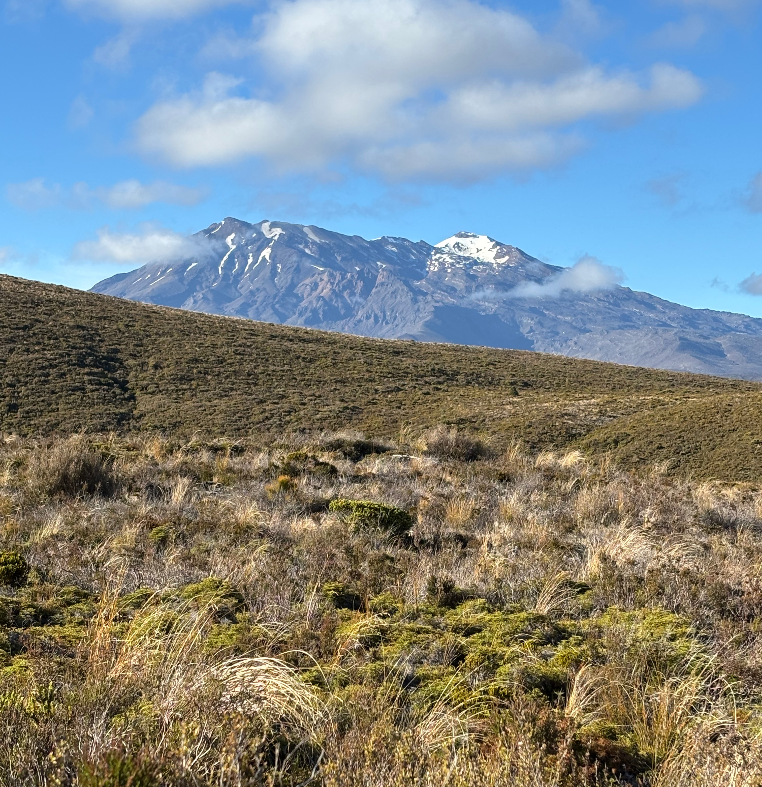
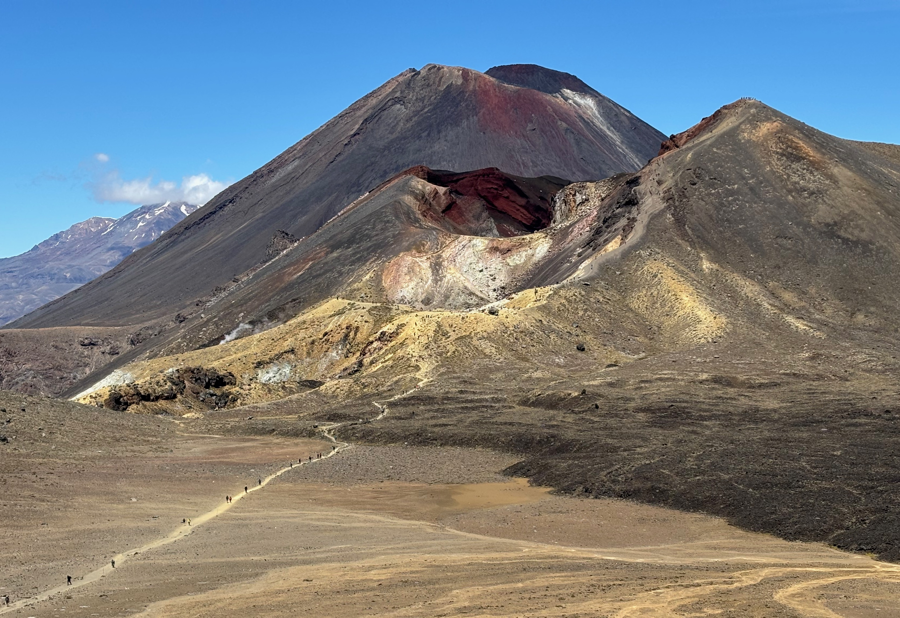
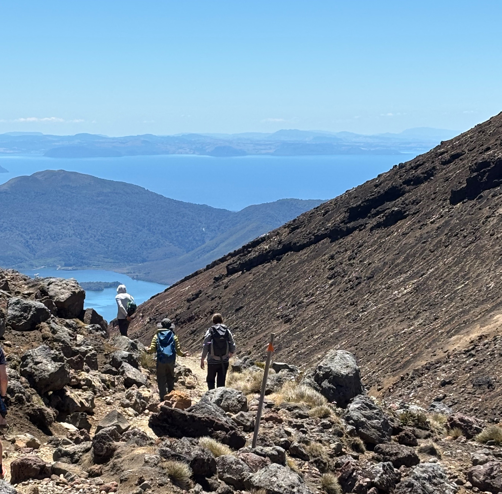

The [Tongariro Alpine Crossing][1] is a challenging 20km one-way hike through volcanic landscape. The trail climbs 765m (~2510 ft.) from the trail head at the end of Mangatepopo road up to the Red Crater summit and then down over 1000m to the pickup point at Ketetahi. Three volcanoes sit at the center of New Zealand's North Island. _Tongariro_ is farthest North. _Ruapehu_ to the South is the highest at 2,797m (9176 ft.). Between them is conical _Ngauruhoe_, also known as Mount Doom. See [Google Maps][2].

We took [Dempsey Buses][4], which is a great way to get to and from the trail - much better than having to drive and navigate while exhausted. They'll pick you up bright and early, aiming to have you on the trail by 7am.

We picked a blue sky day. You'll want to check [NIWA weather forcast for the Red Crater summit][3]. My kiddos age 12 (almost) and 17 easily outpaced their tired old man. The driver said there were about 1500 people on the trail that day while a really busy day might see up to 3000, so don't expect splendid isolation.

The trail is tough. It's steep going up and coming down. The lower sections have lots of wood-framed steps. The upper section of trail the leads up to the Red Crater summit, at 1868m (6129 ft.), is crumbly gravel and fine powder dust. My fitbit said I took over 35,000 steps.

At Ketetahi, there's a shady shelter to wait in. The day I was there, buses came to the pickup at 2:30, 4, and sometime later for the stragglers. If we made the 4 o'clock, you can too. You'll be showered and sitting down to dinner at a very civilized hour.

## Ohakune

Ohakune is a cool little town. It has great views of snow-capped Ruapehu and a few restaurants - we enjoyed _Osteria_. The ISite tourist office is friendly and helpful. If you're not worn out yet, there's a great little rock wall with autobelays at [Vertigo Climbing Ohakune][6].

[1]: https://www.doc.govt.nz/parks-and-recreation/places-to-go/central-north-island/places/tongariro-national-park/things-to-do/tracks/tongariro-alpine-crossing/
[2]: https://www.google.com/maps/@-39.1634219,175.5839858,83111m/data=!3m1!1e3?entry=ttu&g_ep=EgoyMDI1MDEwMS4wIKXMDSoASAFQAw%3D%3D
[3]: https://weather.niwa.co.nz/parks/Tongariro%20National%20Park/Red%20Crater
[4]: https://www.dempseybuses.co.nz/Services/Tongariro+Crossing.html
[6]: https://www.vertigoclimbing.co.nz/
