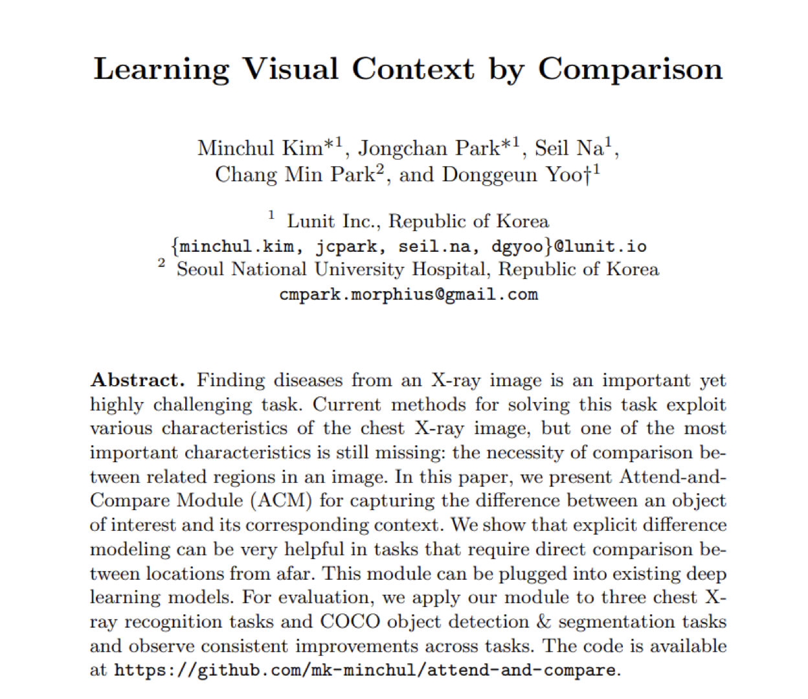
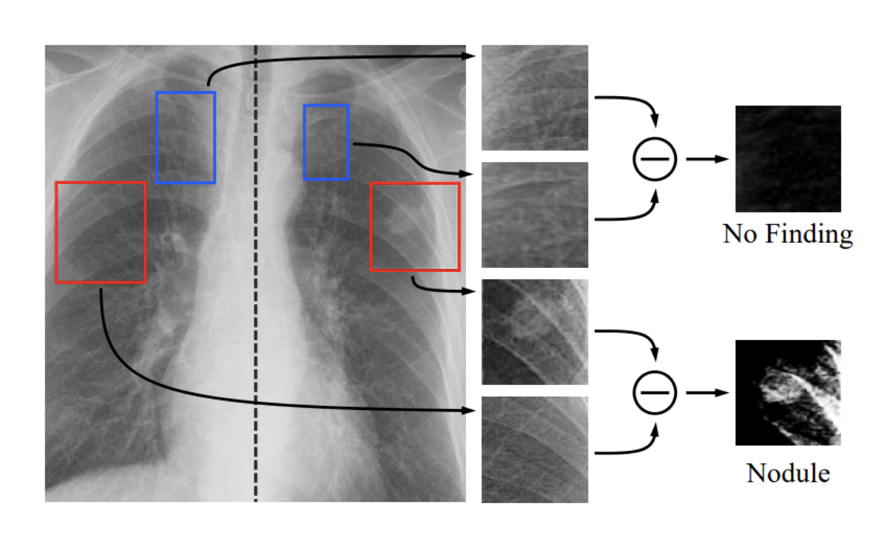
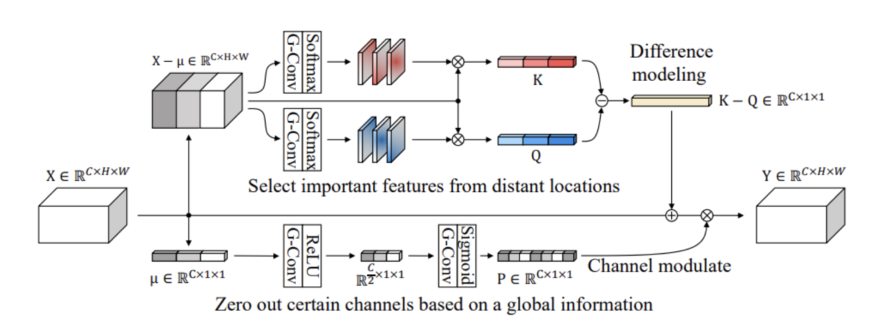
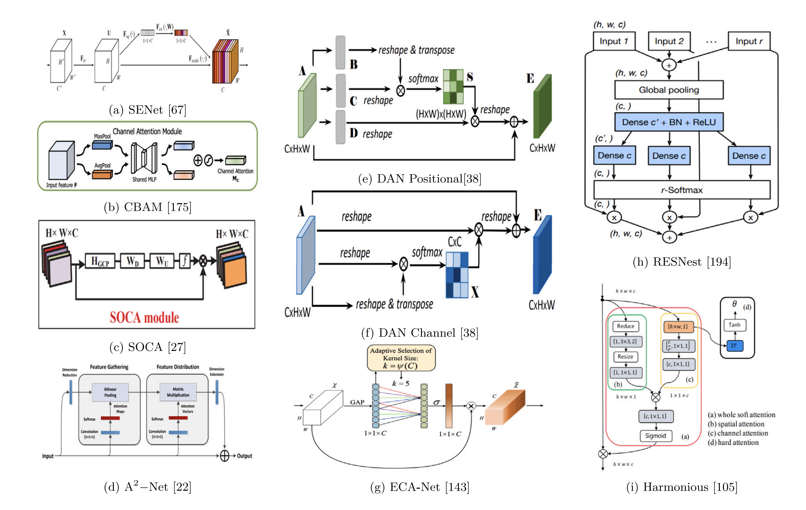
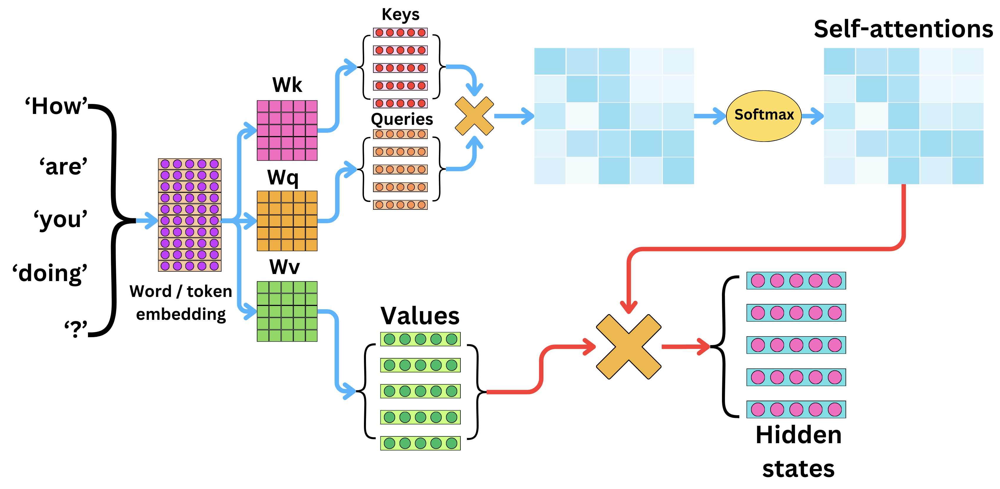

## TL;DR

The paper [Learning Visual Context by Comparison][1] describes the "Attend-and-compare" module, a light-weight attention mechanism that can be added on to ResNet-style computer vision models. It was published in July of 2020 by folks from [Lunit][9].

Since Lunit is now the parent company of my present employer, I thought it would be nice to find out something about their cool ideas. First, let's meet the authors.

## Authors

- [Minchul Kim][2] (김민철) - (Lunit: 2018-2021), now at Google working on the Veo video generation model.
- [Jongchan Park][3] (박종찬) - (Staff Research Scientist at Lunit: 2018–current), organized [Multi-Modal Foundation Models for Cancer Detection and Prevention][4].
- [Seil Na][5] (나세일) - (Research Scientist, Lunit 2019-current)
- [Chang Min Park][6] (박창민) - Radiology, Seoul National University Hospital
- [Donggeun Yoo][7] (유동근) - (Co-founder & Chief of Research at Lunit)

Jongchan Park. Donggeun Yoo, (Aiden) Sunggyun Park, Kyunghyun Paeng,  were lab-mates in a [group run by In So Kweon at Korea Advanced Institute of Science and Technology][8] (KAIST) in Daejeon, South Korea, a public research university founded in 1971, known as the "MIT of South Korea". This paper builds on [CBAM: Convolutional Block Attention Module][10] (2018) from that lab.

<figure style="height: 55%; width: 55%; margin-left: 8em; margin-top: 2em;">
    
    <figcaption style="font-size: small; font-style: italic;">Professor In So Kweon (권인소) at KAIST Korea Advanced Institute of Science and Technology</figcaption>
</figure>

## Context

In late 2025, the time for application-specific tweaks to convolutional neural networks is probably about over, replaced by transformers. This paper came during a wave of exploration of variants of CNN architectures.

### Timeline of Computer vision

- Backpropagation Applied to Handwritten Zip Code Recognition, Y. LeCun et al, 1989
- AlexNet, ImageNet Classification with Deep Convolutional Neural Networks, Alex Krizhevsky, Ilya Sutskever, Geoffrey E. Hinton, 2012
- Neural Machine Translation by Jointly Learning to Align and Translate, September 2014
- ResNet, December 2015
- YOLO (You Only Look Once), June 2015
- Attention Is All You Need, June 2017
- Vision transformers, October 2020

### Convolutional Neural Networks

## Attend-and-compare method

### Inspiration

"We paid attention to how radiology residents are trained, which led to the following question: why don’t we model the way radiologists read X-rays? When radiologists read chest X-rays, they compare zones, paying close attention to any asymmetry between left and right lungs, or any changes between semantically related regions, that are likely to be due to diseases."

"In this paper, we present a novel module, called Attend-and-Compare Module (ACM), that extracts features of an object of interest and a corresponding context to explicitly compare them by subtraction, mimicking the way radiologists read X-rays."

### Computing the ACM block

The ACM block computes K by projecting the feature map $$X$$ with a learned weight matrix $$W_K$$ and applying softmax over spatial locations to produce a $$C \times 1 \times 1$$ vector, and doing similarly for Q.

$$
X \in \mathbb{R}^{C \times H \times W}
$$

This is equation (2) of the paper:

$$
K = \sum_{i,j \in H,W}
    \frac{
        \exp(W_K X_{i,j})
    }{
        \sum_{h,w} \exp(W_K X_{h,w})
    }
    X_{i,j}
$$

I think $$K$$ and $$Q$$ are little easier to read like this:

$$
K = \sum_{i,j}
    \operatorname{softmax}_{h,w}\!\big(W_K X\big)_{i,j}\,
    X_{i,j}
$$

$$
Q = \sum_{i,j}
    \operatorname{softmax}_{h,w}\!\big(W_Q X\big)_{i,j}\,
    X_{i,j}
$$

$$
K, Q \in \mathbb{R}^{C \times 1 \times 1}
$$

Subtracting $$K-Q$$ highlights contrasting features. To get the result of the ACM we add that difference between $$K$$ and $$Q$$ back to the feature map $$X$$ and multiply by $$P$$:

$$
F_{acm}(X) = P(X + (K-Q))
$$

...where $$P$$ is a squeeze-and-excitation block whose job it is to highlight features that are helpful for solving the task at hand.

$$
P = \sigma \circ \text{conv}^{1\times1}_{2} \circ \text{ReLU} \circ \text{conv}^{1\times1}_{1}(\mu)
$$

### CNNs with Attention

A nice review paper that covers related methods is [Visual attention methods in deep learning: An in-depth survey Hassanin, 2024][102] from which we get this figure:

In the figure, (a) is the squeeze-and-excitation (SE) block. Convolutional Block Attention Module (CBAM), (b), is another channel attention method for learning to attend to informative regions from the same lab at KAIST.

### Comparison with transformer-style self-attention

In transformers, K and Q are projections of individual tokens or image patches in vision transformers and they are used to compute pairwise attention. In ACM, K and Q are globally-pooled summaries of two contrasting regions, e.g. left lung vs right lung, which are subtracted to explicitly model comparison. This signal is then injected back to the feature map with the effect of highlighting difference.

$$
K = W_K a_i, \; Q = W_Q a_j, \; V = W_V a_j
$$

$$
\text{Attention}(Q, K, V)
= \text{softmax}\!\left(\frac{QK^\top}{\sqrt{d}}\right)V
$$

## Is it still worth knowing?

The attend-and-compare paper is from 2020 and sits in the “CNN plus attention” niche of the era before vision transformers. It’s a plug-in module for convolutional backbones that (a) learns where to look, and (b) adds channel reweighting. ACM makes explicit the inductive bias that comparison is important by encoding a difference signal and injecting it back into the feature map.

The focus of research has largely moved on to vision transformers and after that to multimodal foundation models. Pragmatically, though, modern CNNs remain competitive with transformers in applied settings.

## More

- [Learning Visual Context by Comparison][1]
- [Stanford CS231N Deep Learning for Computer Vision - 2025][101]

[1]: https://arxiv.org/abs/2007.07506
[2]: https://mckim.dev/
[3]: https://sites.google.com/view/jongchanpark
[4]: https://sites.google.com/lunit.io/iccv25-mmfmc
[5]: https://seilna.github.io/
[6]: https://scholar.google.com/citations?user=ACimkrMAAAAJ&hl=en
[7]: https://dgyoo.github.io/
[8]: https://ee.kaist.ac.kr/en/professor/kweon-in-so-2/
[9]: https://www.lunit.io/en/
[10]: https://arxiv.org/abs/1807.06521
[101]: https://www.youtube.com/playlist?list=PLoROMvodv4rOmsNzYBMe0gJY2XS8AQg16
[102]: https://arxiv.org/abs/2204.07756
