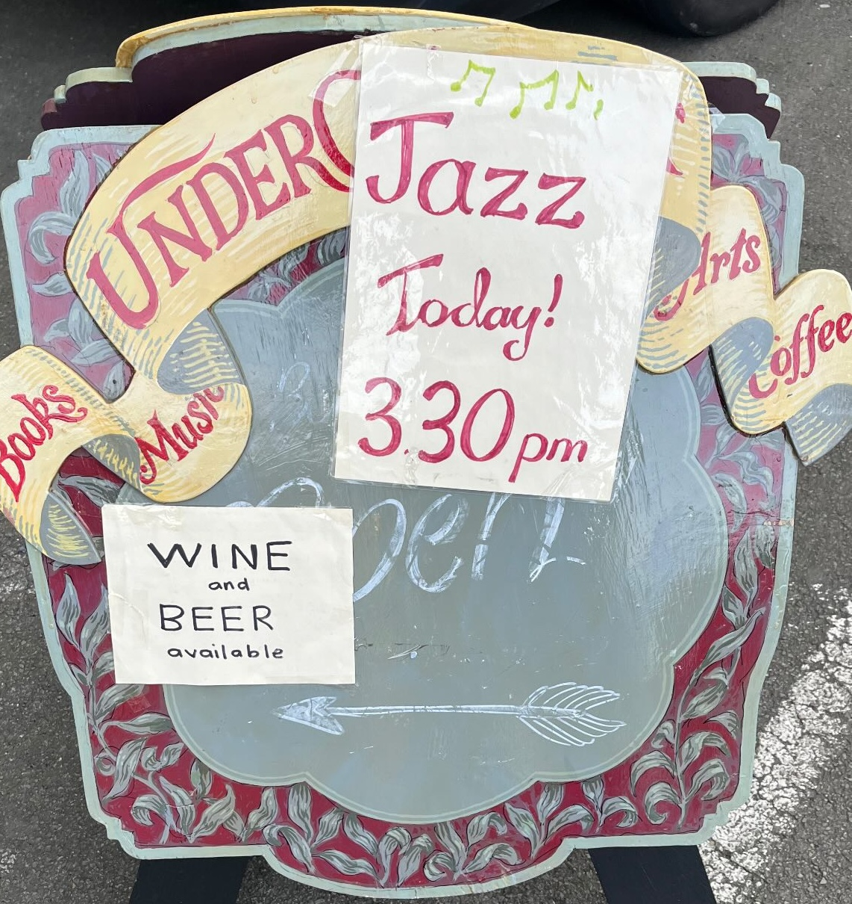
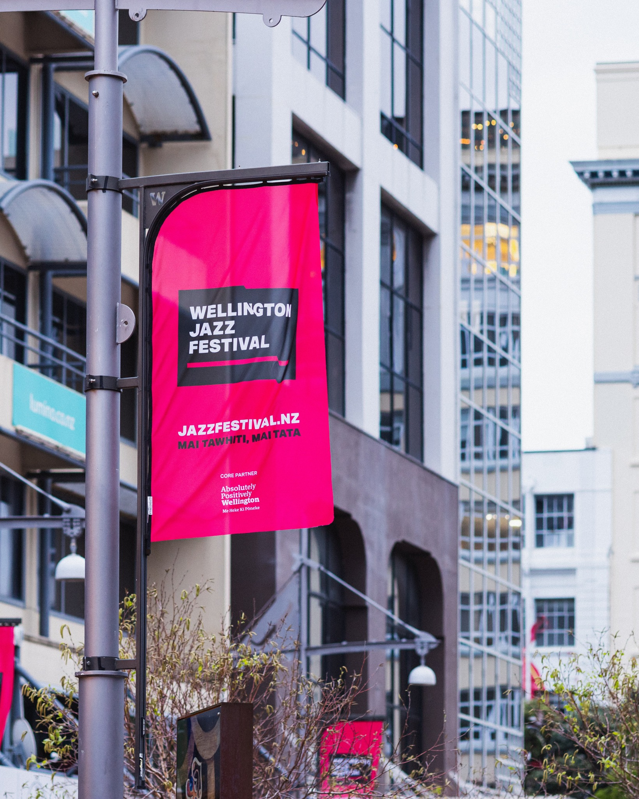
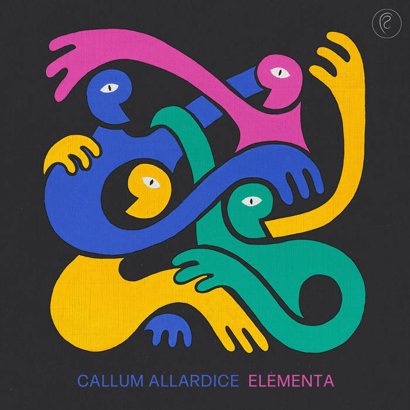
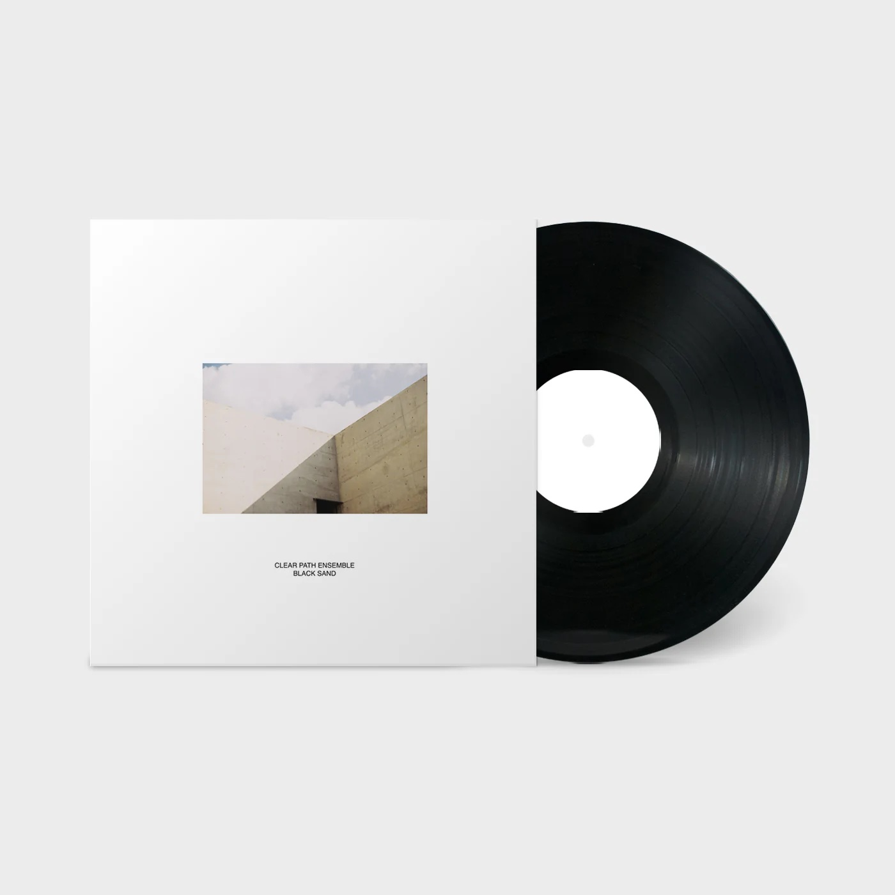
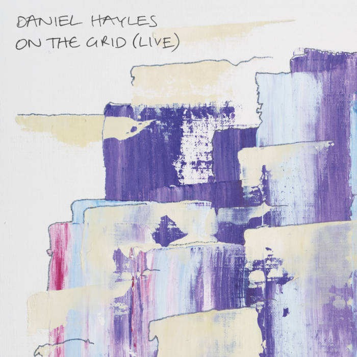
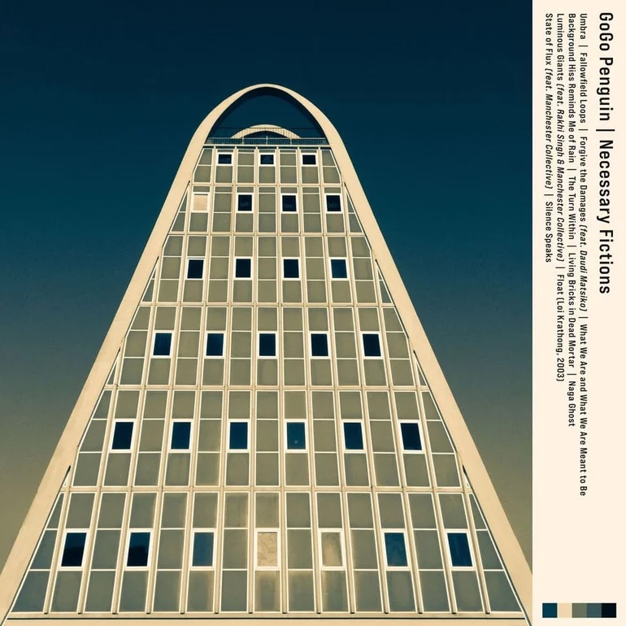
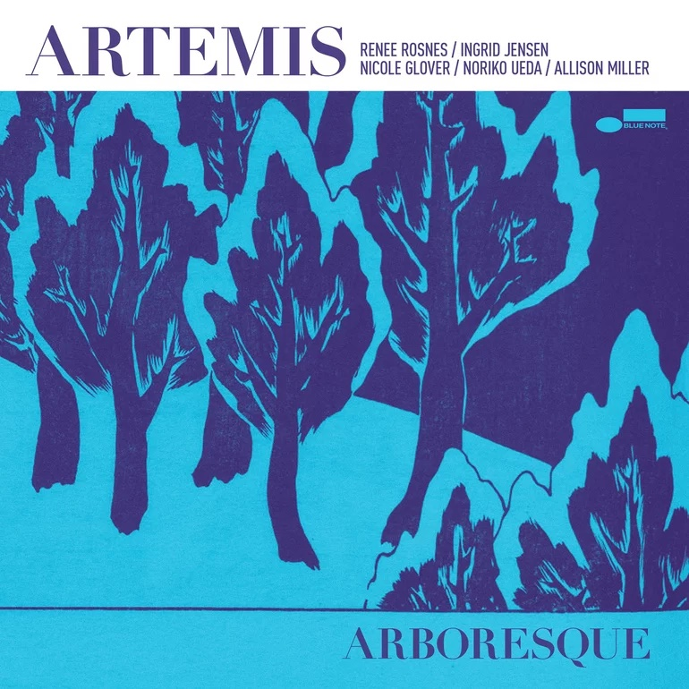
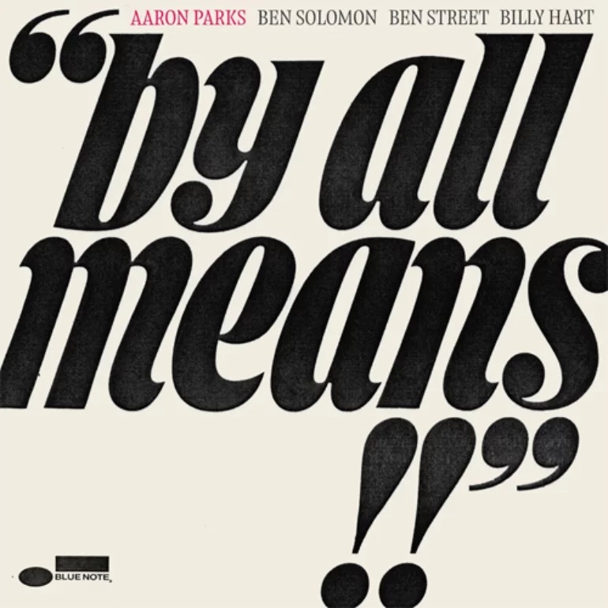
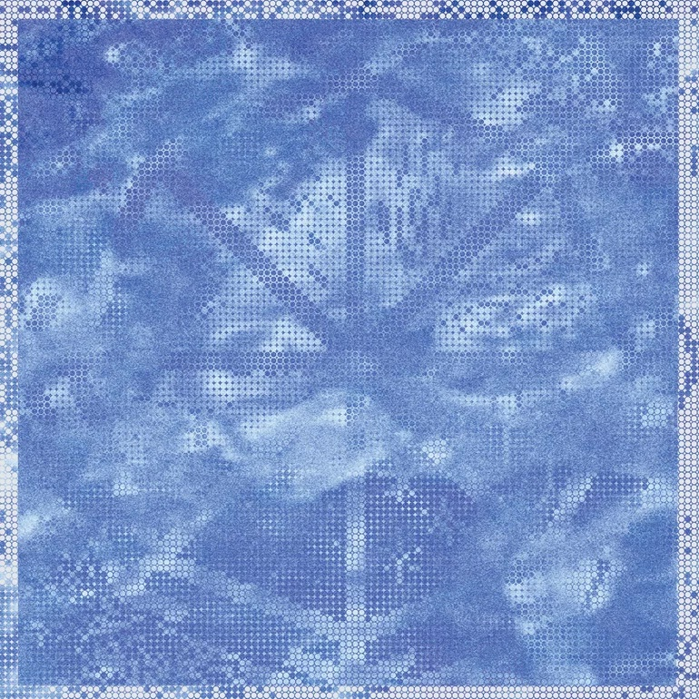

<figure style="float: right; height: 55%; width: 55%; margin-left: 1em;">
  
  <figcaption style="font-size: small; font-style: italic;">Me enjoying some tunes at the lab</figcaption>
</figure>

The years are short but the days are long. Another year come and gone. But still, there's music.

Queue up the [2025 playlist][1013] and read my super deep thoughts on music from the year just gone.

## Wellington Jazz

Wellington has had a rough couple of years with the New Zealand government in a phase of austerity. Luckily, the music scene is going strong. Someone at the [New Zealand School of Music][1005] is doing something right, judging by the quality of musicians with associations of one kind or another with the school.

This year, when I wasn't busy at the lab, I got out to hear some talented Wellington musicians work their magic. Most Sundays, you can start out at the [Undercurrent Bookshop][5] at 3:30, then head over to the [Rogue and Vagabond][6] for Sunday Jazz at 5, which is always fun.

<figure style="float: right; margin-left: 2em; margin-top: 1em; margin-bottom: 2em; height: 50%; width: 50%; ">
  
  <figcaption style="font-size: small; font-style: italic;">This chart could probably act as a pretty good proxy for my mood during the months of 2025. As a public service announcement, November sucks in this part of the world. </figcaption>
</figure>

<figure style="float: left; height: 33%; width: 33%; margin-top: 1em; margin-left: 2em; margin-bottom: 2em; ">
  
</figure>

### Wellington Jazz Festival

<figure style="float: left; width: 25%; margin-top: 1em; margin-right: 2em; margin-bottom: 2em; ">
  
</figure>

2025 was a strong year for the [Wellington Jazz Festival][4] especially where local talent is concerned.

Next year's [Jazz Fest will be October 14-18][4]. In the meantime, keep up with what's on in Welly with their handy [Gig Guides][7].

So much great music is lost into the air, never to be captured again, or so says Eric Dolphy. It's great when some of it gets recorded. A cabal of Wellington Jazzers put out albums in 2025. It's cool to see a group of musicians that play on each others albums, go to each other's shows and clearly push each other further into inspired sonic territory.

### Callum Allardice - Elementa

<figure style="float: right; margin-left: 2em; margin-top: 1em; margin-bottom: 2em; height: 33%; width: 33%; ">
  
</figure>

released January 24, 2025

- [Callum Allardice][1001] - composer, guitar
- Luke Sweeting - piano
- Tom Botting - bass
- Hikurangi Schaverien-Kaa - drums

Composer and guitar player [Callum Allardice][1001] released a quartet album in 2025 full of good stuff. That follows a big-band album [Cinematic Light Orchestra][1003] completed during a [composition residency at Victoria University of Wellington][1004].

Callum played in several combinations during Jazz Fest that featured some strong but as-yet unreleased material, at least as far as my Googling skills can dig up. Song titles I managed to catch included _The Curse_, _The Right Hand of the Blessed_ and _The Left Hand of the Damned_. I hope to hear recordings of these tunes someday soon. Sounds to me like they should be a suite - _The Cursed, the Blessed and the Damned_ - but what do I know?.

Allardice and Sweeting also played together as part of [Antipodes][1009]. They're last release was _Good Winter_ back in 2018. They played under that name along with Jake Baxendale (sax), Tom Botting (bass) and Tim Geldens (drums) for Jazz Fest, then a New Zealand mini-tour that ended up back in Welly again sounding super tight after a few weeks playing together. We can hope some of that material is sitting on a hard drive somewhere waiting to be released.

### Louisa Williamson - Groundwork

<figure style="float: right; margin-left: 2em; margin-top: 1em; margin-bottom: 2em; height: 33%; width: 33%; ">
  
</figure>

[Louisa Williamson][1006] is a sax and flute player, band leader, and composer of jazzy, soulful and funktastic music. This past year's [Groundwork][1008] follows [What Dreams May Come][1007], a five-movement suite for jazz orchestra taking inspiration from Brian Eno and Maria Schneider.

released April 17, 2025

- Louisa Williamson - saxophone/flute/vocals
- Kaito Walley - trombone (In Tune, Lake Glass, Lou Lou)
- Callum Allardice - guitar
- Daniel Hayles - piano
- Johnny Lawrence - bass
- Cory Champion - drums, percussion
- Maarire Brunning-Kouka - vocals (In Tune)

### Clear Path Ensemble - Black Sand

<figure style="float: right; margin-left: 2em; margin-top: 1em; margin-bottom: 2em; height: 33%; width: 33%; ">
  
</figure>

I can't beat the official blurb on this one: “Inspired by the deep listening ambient and jazz record bars of Japan, Black Sand continues with Clear Path Ensemble’s jazz-funk fusion sound while folding new elements of minimalism, ambient, techno and library music into a restrained, yet highly exploratory sound world.”

released May 15, 2025

- Cory Champion - drums, percussion, vibraphone, guitar, electric bass, rhodes, synthesizers
- Johnny Lawrence - double bass, electric bass
- Daniel Hayles - piano, rhodes, clavinet
- James Illingworth - synthesizer
- Louisa Williamson - flute
- Mike Isaacs - bass clarinet

When this crew announced they were playing at the Begonia House, I was skeptical. How are you going to have a show in a greenhouse? Well, turns out it's a super cool venue and it was a great show.

### Daniel Hayles - On the Grid

<figure style="float: right; margin-left: 2em; margin-top: 1em; margin-bottom: 2em; height: 33%; width: 33%; ">
  
</figure>

Whether it's solo piano or 17-piece big-band, I always leave a Daniel Hayles gig with homework. He's great at turning up deep cuts that soon make there way onto your playlists.

During Jazz Fest, Daniel led a fantastic performance of the Other Futures Big Band doing a thing they describe as “Turntablism sensibility on a symphonic scale” at Meow Nui. The set list featured works by Stealy Dan, Notorious B.I.G., NZ composer [Jonathan Crayford][1010].

released October 20, 2025

- Sylvester Green - Trumpet
- Tyaan Singh - Alto Saxophone
- Louisa Williamson - Tenor Saxophone and Flute
- Chris Buckland - Tenor Saxophone
- Matthew Allison - Trombone
- Daniel Hayles - Piano
- Seth Boy - Bass
- Abe Baillie - Drums
- Mana Waiariki - Violin
- Eden Annesley - Violin
- Abby Wheeler - Viola
- Lavinnia Rae - Cello

## The Outside World

Out in the wider world across thousands of miles of ocean, things are a mess. A world order is collapsing. But still, good music is being made.

### Gogo Penguin - Necessary Fictions

<figure style="float: right; margin-left: 2em; margin-top: 1em; margin-bottom: 2em; height: 33%; width: 33%; ">
  
</figure>

released: June 20, 2025

- Chris Illingworth – piano, synthesizers, strings arrangement
- Nick Blacka – double bass, bass guitar, synthesizers
- Jon Scott – drums

### Artemis - ARBORESQUE

<figure style="float: right; margin-left: 2em; margin-top: 1em; margin-bottom: 2em; height: 33%; width: 33%; ">
  
</figure>

released: February 28, 2025

### Aaron Parks - By All Means

<figure style="float: right; margin-left: 2em; margin-top: 1em; margin-bottom: 2em; height: 33%; width: 33%; ">
  
</figure>

Seattle native pianist Aaron Parks

released: November 7, 2025

Aaron Parks - piano
Ben Solomon - tenor saxophone
Ben Street - bass
Billy Hart - drums

### Raven Gnosis

<figure style="float: right; margin-left: 2em; margin-top: 1em; margin-bottom: 2em; height: 33%; width: 33%; ">
  
</figure>

### Other good stuff

- Shai Maestro - Solo: Miniatures & Tales
- Julia Hülsmann - Under the Surface
- [Tom Ollendorf][1012] - Where in the World
- lvdf
- Tourismo - Torque (2023)
- Lucy Clifford - Between Spaces Of Knowing (2024)
- Antipodes - Good Winter (2018)

## Alfred Brendel

## 3 Shades of Blue

decline
moving away
in a world degraded by authoritarian and atavistic impulses
High water mark

[Music 2024]()

[2]: https://www.instagram.com/louisawmusic/
[3]: 
[4]: https://www.jazzfestival.nz/
[5]: https://www.undercurrent.nz/
[6]: https://rogueandvagabond.co.nz/
[7]: https://www.instagram.com/welljazzfest/
[8]: https://www.lucycliffordmusic.com/
[9]: https://www.reddit.com/r/Jazz/comments/1nx6t6k/what_are_your_favourite_jazz_albums_of_2025_so_far/
[10]: https://www.nytimes.com/2025/12/05/arts/music/best-jazz-albums.html
[11]: https://slate.com/culture/2025/12/best-jazz-2025-albums-music-songs-youtube.html
[12]: https://www.jazzwise.com/features/article/the-20-best-new-jazz-albums-of-2025-jazzwise-critics-poll
[13]: https://www.popmatters.com/best-jazz-albums-of-2025

[1001]: https://callumallardice.bandcamp.com/album/elementa
[1002]: https://www.lukesweeting.com/music
[1003]: https://callumallardice.bandcamp.com/album/cinematic-light-orchestra
[1004]: https://www.wgtn.ac.nz/fhss/about/news/2022-composer-in-residence-shines-bright-with-debut-album-release
[1005]: https://www.wgtn.ac.nz/nzsm
[1006]: https://www.louisawilliamson.com/
[1007]: https://louisawilliamson.bandcamp.com/album/what-dreams-may-come
[1008]: https://louisawilliamson.bandcamp.com/album/groundwork
[1009]: https://www.danielhayles.com/about
[1010]: https://www.jonathancrayford.com/
[1011]: https://www.theguardian.com/music/2025/jun/17/celebrated-pianist-and-writer-alfred-brendel-dies-aged-94
[1012]: https://www.tomollendorff.com/
[1013]: https://music.apple.com/us/playlist/2025-playlist/pl.u-JPAZEo9FWl6GeE
