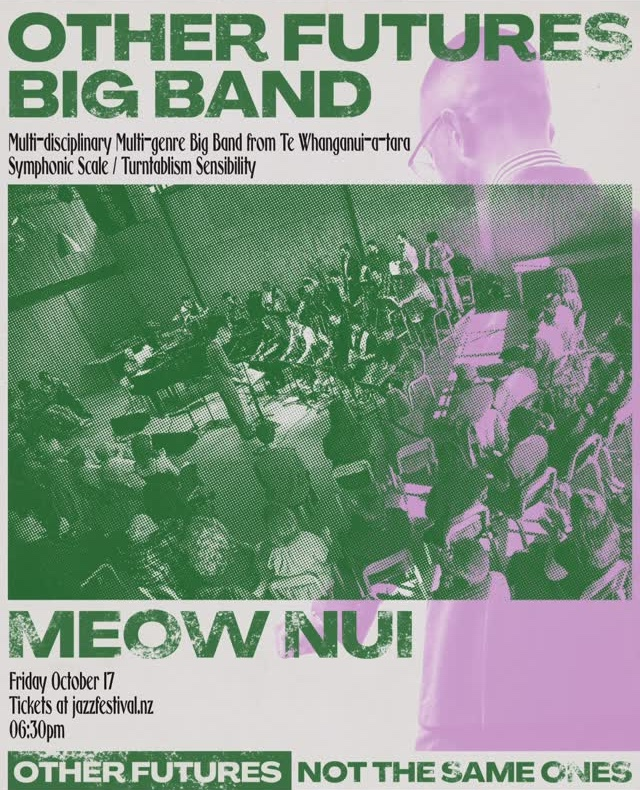
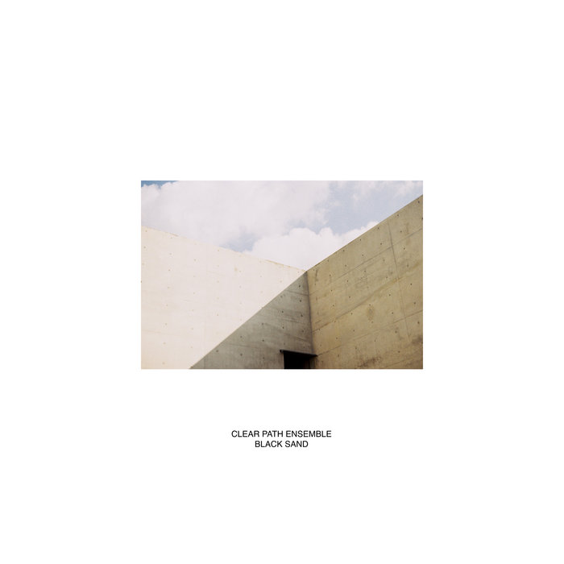
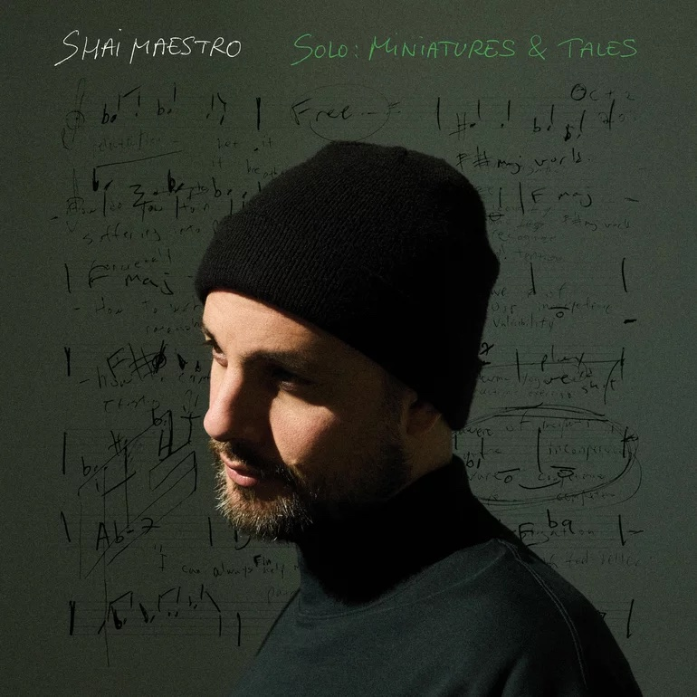

<figure style="float: right; height: 55%; width: 55%; margin-left: 1em;">
  
  <figcaption style="font-size: small; font-style: italic;">Me enjoying some tunes at the lab</figcaption>
</figure>

The years are short but the days are long. Another year come and gone. But still, there's music.

## Wellington Jazz

Wellington has had a rough couple of years with the New Zealand government in a phase of austerity. Luckily, the music scene is going strong. Someone at the New Zealand School of Music is doing something right, judging by the inspired musicians coming out of there.

This year, when I wasn't busy at the lab, I got out to hear some talented Wellington musicians work their magic. Most Sundays, you can start out at the [Undercurrent Bookshop][5] at 3:30, then head over to the [Rogue and Vagabond][6] for Sunday Jazz at 5, which is always fun.

<figure style="float: right; margin-left: 2em; margin-top: 1em; margin-bottom: 2em; height: 50%; width: 50%; ">
  
  <figcaption style="font-size: small; font-style: italic;">This chart could probably act as a pretty good proxy for my mood during the months of 2025. As a public service announcement, November sucks in this part of the world. </figcaption>
</figure>

<figure style="float: left; height: 33%; width: 33%; margin-top: 1em; margin-left: 2em; margin-bottom: 2em; ">
  
</figure>

### Wellington Jazz Festival

The [Wellington Jazz Festival][4] was especially strong for local talent in 2025. Next year's [Jazz Fest will be October 14-18][4]. In the meantime, keep up with what's on in Welly with their handy [Gig Guides][7].

So much great music is, as Eric Dolphy said, lost into the air, never to be captured again. So, it's great when some of it gets recorded. A cabal of Wellington Jazzers put out albums in 2025. It's cool to see a group of musicians that play on each others albums, go to each other's shows and clearly push each other further into inspired sonic territory.

### Callum Allardice - Elementa

<figure style="float: right; margin-left: 2em; margin-top: 1em; margin-bottom: 2em; height: 33%; width: 33%; ">
  
</figure>

released January 24, 2025

- Callum Allardice - composer, guitar
- Luke Sweeting - piano
- Tom Botting - bass
- Hikurangi Schaverien-Kaa - drums

Callum played some great tunes live that aren't on this release, in particular, _The Curse_, _The Right Hand of the Blessed_ and _The Left Hand of the Damned_. Sounds like a suite to me: _The Cursed, the Blessed, and the Damned_.

### Louisa Williamson - Groundwork

<figure style="float: right; margin-left: 2em; margin-top: 1em; margin-bottom: 2em; height: 33%; width: 33%; ">
  
</figure>

[Louisa Williamson][2]

released April 17, 2025

- Louisa Williamson - saxophone/flute/vocals
- Kaito Walley - trombone (In Tune, Lake Glass, Lou Lou)
- Callum Allardice - guitar
- Daniel Hayles - piano
- Johnny Lawrence - bass
- Cory Champion - drums, percussion
- Maarire Brunning-Kouka - vocals (In Tune)

### Clear Path Ensemble - Black Sand

<figure style="float: right; margin-left: 2em; margin-top: 1em; margin-bottom: 2em; height: 33%; width: 33%; ">
  
</figure>

“Inspired by the deep listening ambient and jazz record bars of Japan, Black Sand continues with Clear Path Ensemble’s jazz-funk fusion sound while folding new elements of minimalism, ambient, techno and library music into a restrained, yet highly exploratory sound world.”

released May 15, 2025

- Cory Champion - drums, percussion, vibraphone, guitar, electric bass, rhodes, synthesizers
- Johnny Lawrence - double bass, electric bass
- Daniel Hayles - piano, rhodes, clavinet
- James Illingworth - synthesizer
- Louisa Williamson - flute
- Mike Isaacs - bass clarinet

### Daniel Hayles - On the Grid

<figure style="float: right; margin-left: 2em; margin-top: 1em; margin-bottom: 2em; height: 33%; width: 33%; ">
  
</figure>

https://www.danielhayles.com/about

released October 20, 2025

- Sylvester Green - Trumpet
- Tyaan Singh - Alto Saxophone
- Louisa Williamson - Tenor Saxophone and Flute
- Chris Buckland - Tenor Saxophone
- Matthew Allison - Trombone
- Daniel Hayles - Piano
- Seth Boy - Bass
- Abe Baillie - Drums
- Mana Waiariki - Violin
- Eden Annesley - Violin
- Abby Wheeler - Viola
- Lavinnia Rae - Cello

## NZ/Aussie Jazz

Antipodes

<figure style="float: right; margin-left: 2em; margin-top: 1em; margin-bottom: 2em; height: 33%; width: 33%; ">
  
</figure>

Tourismo is co-led by pianist Matthew Thomson and drummer Alex Hirlian, and features Michael Avgenicos on tenor sax, guitarist Josh Meader and Nick Henderson on bass.

Lucy Clifford Between Spaces Of Knowing 2024

<figure style="float: right; margin-left: 2em; margin-top: 1em; margin-bottom: 2em; height: 33%; width: 33%; ">
  
</figure>

### Gogo Penguin - Necessary Fictions

<figure style="float: right; margin-left: 2em; margin-top: 1em; margin-bottom: 2em; height: 33%; width: 33%; ">
  
</figure>

released: June 20, 2025

- Chris Illingworth – piano, synthesizers, strings arrangement
- Nick Blacka – double bass, bass guitar, synthesizers
- Jon Scott – drums

### Artemis - ARBORESQUE

<figure style="float: right; margin-left: 2em; margin-top: 1em; margin-bottom: 2em; height: 33%; width: 33%; ">
  
</figure>

released: February 28, 2025

### Aaron Parks - By All Means

<figure style="float: right; margin-left: 2em; margin-top: 1em; margin-bottom: 2em; height: 33%; width: 33%; ">
  
</figure>

Seattle native pianist Aaron Parks

released: November 7, 2025

Aaron Parks - piano
Ben Solomon - tenor saxophone
Ben Street - bass
Billy Hart - drums

Tom Ollendorf

3 Shades of Blue

## New this year

Shai Maestro - Solo: Miniatures & Tales

<figure style="float: right; margin-left: 2em; margin-top: 1em; margin-bottom: 2em; height: 33%; width: 33%; ">
  
</figure>

Artemis - ARBORESQUE
Julia Hülsmann - Under the Surface

### Raven Gnosis
<figure style="float: right; margin-left: 2em; margin-top: 1em; margin-bottom: 2em; height: 33%; width: 33%; ">
  
</figure>

[Music 2024]()

https://www.theguardian.com/music/2025/jun/17/celebrated-pianist-and-writer-alfred-brendel-dies-aged-94

Open During Construction
Geoffery Keezer

## Shows

“Lost into the air” - Eric Dolphy quote

Clear Path Ensemble at Begonia House. Save Begonia House.

Wellington Jazz Festival

[2]: https://www.instagram.com/louisawmusic/
[3]: 
[4]: https://www.jazzfestival.nz/
[5]: https://www.undercurrent.nz/
[6]: https://rogueandvagabond.co.nz/
[7]: https://www.instagram.com/welljazzfest/
[8]: https://www.lucycliffordmusic.com/
[9]: https://www.reddit.com/r/Jazz/comments/1nx6t6k/what_are_your_favourite_jazz_albums_of_2025_so_far/
[10]: https://www.nytimes.com/2025/12/05/arts/music/best-jazz-albums.html
[11]: https://slate.com/culture/2025/12/best-jazz-2025-albums-music-songs-youtube.html
[12]: https://www.jazzwise.com/features/article/the-20-best-new-jazz-albums-of-2025-jazzwise-critics-poll
[13]: https://www.popmatters.com/best-jazz-albums-of-2025
