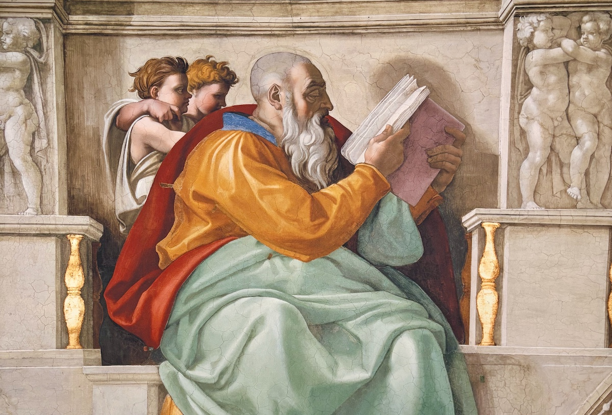

- Babel - R.F. Kuang
- [Orbital](/2025-01-31/orbital.html) - Samantha Harvey
- Erasure - Percival Everett
- 3 Shades of Blue - James Kaplan
- Solaris - Stanislaw Lem
- I'm Starting to Worry About This Black Box of Doom - Jason Pargin
- Tomorrow & Tomorrow & Tomorrow - Gabrielle Zevin
- Player Piano - Kurt Vonnegut
- Hum - Helen Phillips
- Polostan - Neal Stephenson
- Playground - Richard Powers
- In Ascension - Martin MacInnes

The standouts, for me, were _Orbital_, _Hum_, and _Playground_.

See also, [Books 2024]() and [GoodReads](https://www.goodreads.com/user/show/22238686-christopher-bare)

## 本を読む
Honwoyomu - “read a book”
