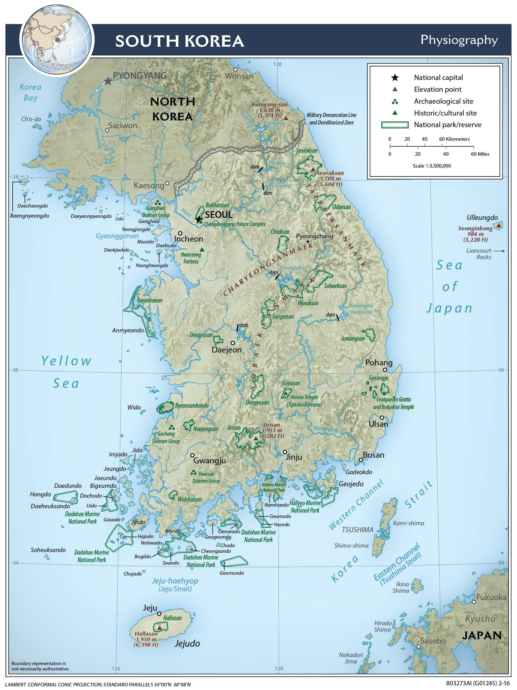
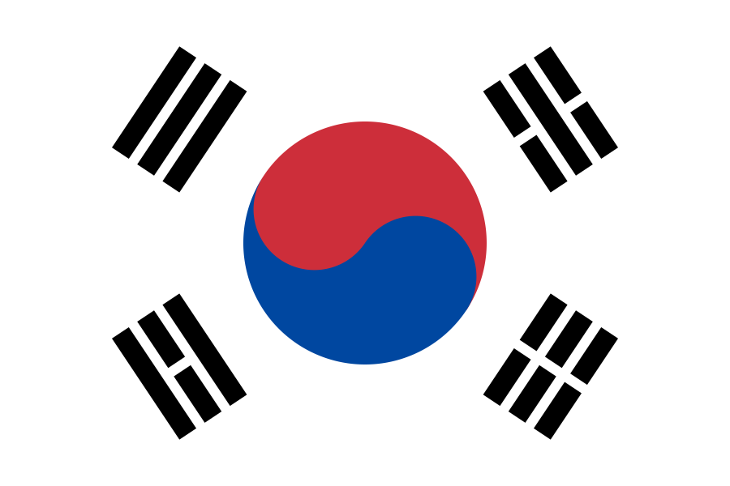

_Thanks to the new-ish ownership of the company I work for, I now have lots of friends in South Korea. Well OK, I have no friends really, but I have work colleagues once removed or something like that. Below is my attempt to learn something about Korea and maybe relate a little better._

{: style="width: 40%; float: right;"}
{: style="width: 100px;"}

[South Korea][1] (officially The Republic of Korea) is a [highly developed][4] nation of 51.6 million located in [East Asia][6]{:target="_blank"}.

The whole Korean peninsula covers an area of 223,516 km², which, for comparison, is smaller than New Zealand at 263,310 km². South Korea occupies about 100k km². The Seoul metro area is home to over 25 million, making it one of the most densely populated places on Earth.

South Korea's economy [ranks 12th-largest in the world][7] with a GDP of 1.88 trillion USD. Per capita, that's 36k USD or 61k at PPP [according to World Bank numbers from 2024][5]. The IMF shows Korea as 15th in 2026, have been overtaken by Spain, Mexico and Australia. South Korea is a global leader in semiconductors, with 60% market share in memory chips. Its economy has a strong presence in auto manufacturering, shipbuilding, petrochemicals, steel, and batteries.

## Korean Language

[Korean is the native language][3] for about 81 million people. In the south, the language is known as Hangugeo (한국어). The Hangul (한글) alphabet uses 14 consonants and 10 basic vowels which combine to form 11 more complex vowels.

### Hangul

Letters are arranged in syllable blocks consisting of an initial consonant, a vowel, and an optional final consonant called batchim (받침). Special rules apply to the last position or batchim. Some letters change pronounciation. Also, 11 consonant digraphs, ㄳ, ㄵ, ㄶ, ㄺ, ㄻ, ㄼ, ㄽ, ㄾ, ㄿ, ㅀ, ㅄ, and the doubled consonants ㄲ and ㅆ can appear in the final position.

_The word for the Korean language is used to illustrate the structure of syllable blocks in a [paper from Kyuhong Shim et al][8]._

For example, you may want to write the phrase "Oppan Gangnam Style", which would be: 오빤 강남스타일 where the last bit, seu-ta-il, is as close as you can get to style. [Go deep on _Gangnam Style_ with someone called The Language Nerd][201].

### Beginner Vocabulary

- 안녕하세요 (an-nyeong-ha-se-yo) - hello
- 안녕히 가세요 (an-nyeong-hi-ga-se-yo) - good bye
- 감사합니다 (gam-sa-ham-ni-da) - thank you

- 네 (ne) or 그래요 (gue-lae-yo) - yes
- 아니요 (a-ni-yo) - no
- 아마도 (a-ma-do) - maybe

- 좋아요 (joh-a-yo) - that's good
- 맞아요 (maj-a-yo) - that's right

### Resources

- [Learn Korean in Korean][102]
- [Hailey Your Korean Friend][103]

[1]: https://en.wikipedia.org/wiki/South_Korea
[2]: https://www.britannica.com/place/South-Korea
[3]: https://en.wikipedia.org/wiki/Korean_language
[4]: https://hdr.undp.org/data-center/specific-country-data#/countries/KOR
[5]: https://data.worldbank.org/indicator/NY.GDP.PCAP.PP.CD?locations=KR
[6]: /images/korea/asia-physical-map.jpg
[7]: https://en.wikipedia.org/wiki/List_of_countries_by_GDP_(nominal)
[8]: https://arxiv.org/abs/2203.03583

[102]: https://www.youtube.com/playlist?list=PLahs8zJoTSMhi6TgVv-xGL5QDv7YU-Bh0
[103]: https://www.youtube.com/@koreanfriendhailey

[201]: https://asktheleagueofnerds.com/gangnam-style/
