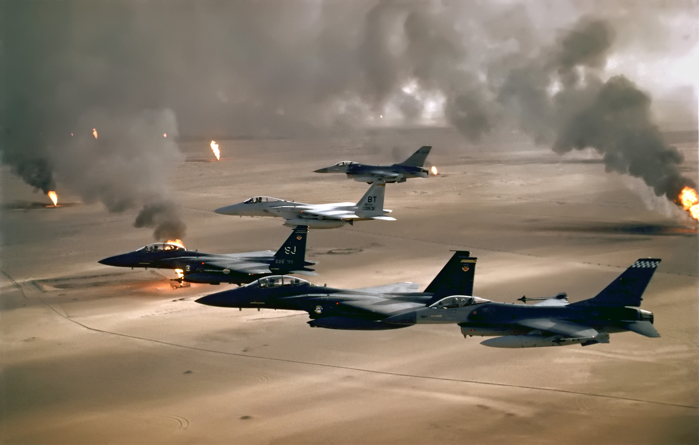
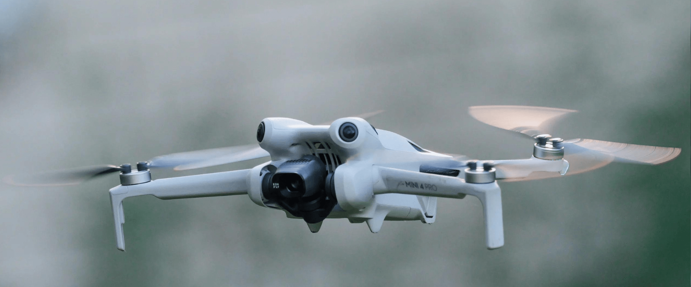

My granddad was born in 1897 and lived until 1988 in a little town called Douglass, Kansas. Within the span of that life, a little over 90 years, aviation went from Kitty Hawk to the Concorde. As a young man, he went to Wichita, the nearest city, for the first time on horseback.

It's worth pondering the transformation of the world during that span of time. Over that time, America went from being an emerging industrial and technological power to the preeminent global superpower. Aviation was a key enabler. It used to be said that we would not see that kind of rapid leap forward again. But, recent breakthroughs in AI appears to put us on a transformative trajectory. Like AI, aviation is a duel use technology. Aircraft can deliver overwhelming force or vacationing families to all corners of the world.

Might we derive some insight from a consideration of how aviation evolved and interacted with economics and geopolitical power? And might that insight inform our understanding of how the current AI revolution will play out as we are swept along by another wave of technological change?

From today's point of view, it seems likely that [AI will enrich our personal lives, reconfigure our economy, and radically change the balance of power in the world][131], at least. What follows is something of a photo-essay the might help build some intuition relevant to a technology, our individual lives and the lives of empires.

We'll see a lot of military hardware. This is not because I'm a big believer in the glory of war. I'm a bigger fan of building, discovery, and innovation than of destruction. Also, this is an American-centered point of view - first, because I'm American. But also, America still, in spite of itself, leads the global system, as of this moment.

With those caveats, let's do a quick tour of aviation technology from the beginning. Or, maybe let's start before that.

## 1489 Leonardo da Vinci

Humans have always dreamed of flying. As an artist, scientist, and engineer, [Leonardo da Vinci][134] was well equiped to give the world some early inklings of what was to come.

_Leonardo da Vinci’s drawing of a helicopter._

_Leonardo da Vinci’s sketch of a flying machine._

## November 21, 1783

_Montgolfier brothers hot-air balloon_

The first manned hot-air balloon, designed by the Montgolfier brothers, takes off from the Bois de Boulogne, Paris, on November 21, 1783. The pilots, Pilatre De Rozier and the Marquis d’Arlandes, flew over Paris for about 20 minutes and traveled 5 miles, landing safely between two windmills on the outskirts of the city. They were preceded by a test flight crewed by a sheep, a duck and a rooster.

## December 17, 1903

## 1916 First Boeing aircraft

The B&W was the very first Boeing aircraft, designed and built by William E. Boeing and Conrad Westervelt, and first flew on June 15, 1916.

_Boeing B&W_

## 1914-1918 WWI

At the start of the first world war, aircraft were used mostly for reconnaissance. [During the war][132], fighting scouts evolved into fighters. The Germans made use of Zeppelins and, later, rudimentary bombers.

### Fokker Dr.I Dreidecker

_Fokker Dr.I Driedekker, ~1917/18_

_German Triplane "Fokker Dr.I" of Jasta 26 at Erchin, France during the World War I_

### Sopwith Camel

The Sopwith Camel helped the Allies wrest aerial superiority from the Germans.

## Interwar period

Aircraft evolved from World War I-style biplanes into sleek, high-performance airliners. A solid infrastructure took shape under government guidance through the Post Office and the Commerce Department, and regulatory reforms reshaped the industry. 

### Air Mail

The U.S. Post Office was an early customer of the nascent airline industry. In 1926, single-engined, open-cockpit Swallow biplanes were used by Varney Air Lines, a predecessor of United Air Lines, to open the first privately-contracted air mail route of the nation between Pasco, Washington, and Elko, Nevada.

_Pilot Leon D. Cuddenback with a Swallow biplane_

### 1927 Lindbergh crosses the Atlantic

On May 21, 1927, at 10:22 p.m. local time, 25-year-old Charles Lindbergh and his silver monoplane, the Spirit of St. Louis, landed in Paris, France, making him the first aviator to successfully fly nonstop across the Atlantic from New York to Paris.

_Charles Lindbergh and the Spirit of St. Louis_

### September, 1928

LZ 127 Graf Zeppelin was 236.6m long and carried a crew of 36 plus 24 passengers. It made 590 flights between 1928 to 1937. It was the longest and largest airship in the world when it was built. It made the first circumnavigation of the world by airship, and the first nonstop crossing of the Pacific Ocean by air and provided a commercial passenger and mail service between Germany and Brazil between 1932 and 1937.

_The LZ 127 Graf Zeppelin airship flying over the Palacio Barolo building in Buenos Aires, Argentina._

### 1937 Hindenburg

_Hindenburg in flames at Lakehurst Naval Air Station, New Jersey, May 6, 1937._

### United Airlines

[Passenger service took root and grew][125], and air routes spread across the country. But because air travel was so expensive, only the wealthy and business travelers flew.

_Passengers boarding a United Airlines Douglas DC-3 "Mainliner" in San Francisco in 1938._

## Boeing 314 Clipper

The Boeing 314 Clipper was a [long-distance flying boat][137] operated by Pan American at a standard of luxury rarely matched since. Twelve were built between 1938 and 1941.

_Boeing 314 clipper cutaway illustration_

In 1939, the California Clipper inaugurated passenger and mail service on the San Francisco-Hong Kong route with stops in Hawaii, Midway Island, Wake Island, Guam Island, Manila, and Macao. It took six days to complete the 9,000 mile route. A ticket cost $760 which is $17,000 in 2024 dollars. Commercial passenger service lasted less than three years due to the war.

_California Clipper flying over Treasure Island in 1939_

## First helicopter flight

September 14, 1939, the VS-300, the world's first practical helicopter, took flight in Stratford, Connecticut, designed and piloted by Igor Sikorsky.

## 1939-1945 WW2

The [Battle of Britain][133] was the first decisive air battle. The Luftwaffe's goal was to gain air superiority over Britain, paving the way for invasion. The RAF, supported by radar and ground-based anti-aircraft systems successfully defended Britain and prevented an invasion.

_Battle of Britain - German plans_

_Supermarine Spitfire_

_German Messerschmitt BF-109s_

In 1905, Japan became the first non-European power to win a major military victory over a European nation. The Meiji era (1868-1912) was an era of modernization and industrialization. Imperial Japan colonized or occupied Korea, parts of China including Manchuria, and much of southeast Asia. Japan seized German possessions in the Pacific and East Asia during the first world war.

Aircraft carriers emerged as a key instrument of war in the Pacific. At the time of the Pearl Harbor attack in December of 1941, Japan had a total of nine fleet and light carriers. America had four in the Pacific. Beginning in December 1942, America  commissioned either a fleet carrier or a light carrier almost every month for the next two years, outstripping Japan's ability to replace and repair damaged ships.

_Petty Officer Second Class (PO2c) Sakae Mori, takes off from the carrier “Akagi” in an A6M2 to participate in the Pearl Harbor attack on December 7, 1941. (National Archives)_

_The [Battle of Midway][110] was a major naval battle of World War II that took place on 4–7 June 1942._

_SBD Dauntless dive bombers from USS Hornet (CV-8) approaching the burning Japanese heavy cruiser Mikuma to make the third set of attacks on her, during the early afternoon of 6 June 1942._

four Japanese carriers Akagi, Kaga, Sōryū, and Hiryū

248 carrier-based aircraft

Yorktown and the destroyer Hammann, while the carriers Enterprise and Hornet 

233 carrier-based aircraft
127 land-based aircraft

"tip of the spear" means to project power to all corners of the world.

Japanese Mitsubishi A6M2 Zero

Grumman F6F Hellcat

Boeing B-17F Flying Fortress

Boeing B-29 Superfortress Enola Gay

## Post-war period

### The Berlin Airlift

The post-war period began ominously with the Soviet blockade of Berlin. In response, the Western Allies organised the Berlin Airlift which delivered over 2.3 million tons of supplies to West Berlin over the 15 months between June 1948 to September 1949.

_C-54 landing at Templehof_

_C-47s at Templehof Airport in Berlin 1948_

After the war ended, production capacity and runways could be turned to civilian commercial use.

### 1953 The Lockheed L-1049 Super Constellation

Variants of the graceful Constellation flew as troop transports during the war and airliners after. The Lockheed L-1049 Super Constellation was a passenger airliner in commercial service between 1953 and 1967.

_Super Connie over New York, 1953._

### 1955 Cessna 172

_Cessna 172_

The Jet Age began for civilian passengers in Britain in 1952 with the first scheduled flight of the de Havilland Comet. Pan American began service on the New York to Paris route with the Boeing 707 on October 26, 1958. The following year was the first in which more transatlantic passengers traveled by air than by sea.

## Cold war
 

## 1952 B-52 Stratofortress

[The B-52][117] is a long-range, heavy bomber that is capable of flying at high subsonic speeds at altitudes up to 50,000 feet (15,166.6 meters). It can carry nuclear or precision guided conventional ordnance with worldwide precision navigation capability.

### SR-71 Blackbird

## Vietnam War

[The Vietnam War is known as the “Helicopter War.”][112] In total, nearly 12,000 helicopters saw action in Vietnam. The young men who flew those helicopters—many of them only 19 or 20 years old—had “absolutely the most dangerous jobs in the war,” he adds.

Bell UH-1 Iroquois “Huey”

Boeing CH-47 Chinook

A military helicopter evacuates people from the U.S. Embassy in Saigon on April 30, 1975, the day the Vietnam War ended.
- John J. Valdez

## Jet age of civil aviation

Pan Am - The 1960 annual report proudly announced "the free world has become a neighborhood."

[...] gave American and Western European middle class a lifestyle that the Soviet block was unable to match. Media and travel made that comparison highly visible. By the way, this material well being is an underappreciated factor in the outcome of the cold war.

## 747

_KLM 747 at Schipol airport near Amsterdam_

In production 1968–2023 
Entered service in 1970

## Concorde

Aérospatiale/BAC Concorde was a British-French supersonic passenger jet airliner. It had a maximum speed of Mach 2.04 (1,354 mph or 2,180 km/h at cruise altitude, over twice the speed of sound), with seating for 92 to 128 passengers. The aircraft entered service in 1976 and continued flying for the next 27 years.

Twenty Concorde aircraft were built with 14 in commercial service.

Most are now in museums. The [one on display in Seattle's Museum of Flight][107] flew the last British Airways commercial Concorde flight, from New York to London, on October 24, 2003.

crashed on takeoff from Charles du Gaulle on Jul. 25, 2000.

high water mark.

## Commercial airline passengers & flights

2023 - 4.4 billion passengers 35.3 million flights
2024 - 5 billion

https://atag.org/facts-figures

1970-2021

https://data.worldbank.org/indicator/IS.AIR.PSGR
https://ourworldindata.org/grapher/number-airline-passengers?tab=chart

Strike groups are a principal element of projection of U.S. power. A single supercarrier holds enough firepower to rival the air forces of entire nations. There are 11 carrier strike groups in the U.S. Navy.

## Falklands War

_Harriers on the deck of the HMS Hermes_

## American hegemony

### 1972 McDonnell Douglas F-15 Eagle

### 1972 A-10 Thunderbolt "Warthog"

### September 30, 1975 Apache AH-64 Attack Helicopter 

### November 18, 1978 McDonnell Douglas F-18 Hornet

### July 17, 1989, B-2 Spirit

### 1991 Gulf War

USAF aircraft of the 4th Fighter Wing (F-16, F-15C and F-15E) fly over Kuwaiti oil fires, set by the retreating Iraqi army during [Operation Desert Storm in 1991.][122]

### September 15, 1991 C-17 Globemaster

[C-17: The US military plane carrying Afghans to safety][121]

### September 7, 1997 Lockheed Martin F-22 Raptor

### December 15, 2006 F-35 Lightning

## The present moment

Another ambitious power is rising.

The [balance of power shifts][128] over time.

“The Typhoons currently deployed as part of 903 Expeditionary Air Wing joined Egyptian Air Force F-16s during Exercise BRIGHT STAR.  This was the first time since 2001 that the RAF have flown with the Egyptian Air Force. T he Typhoons were also joined on the exercise by F-16s from the Greek Air Force and US Air Force F-15s and F-16s together with C-130 Hercules and B-52s.”

[127]

the United States (11), China (3), India (2), Italy (2), and the United Kingdom (2). France and Russia each operate a single aircraft carrier.

## Private jets

While the 707 and 747 enabled the middle class to travel the world, you may prefer a different standard. A beautiful new Gulfstream G700  will cost you $75 million, plus [$4 million per year or $9 thousand per hour][135] in operating costs. But, you won't have to suffer hours of indignities in economy class.

_Gulfstream G700_

## Drones

Lessons of the Ukraine war

## Future of flight

Return to supersonic passenger flight.

Fuel efficient blended wing aircraft.

On 24 October 2024, [Sergey Brin's airship company LTA Research took Pathfinder 1][113] for it's first untethered test flight.

[101]: https://www.thoughtco.com/history-of-airships-and-balloons-1991241
[102]: https://en.wikipedia.org/wiki/LZ_127_Graf_Zeppelin
[103]: https://en.wikipedia.org/wiki/Hindenburg_disaster
[104]: https://airandspace.si.edu/stories/editorial/breaking-sound-barrier-75th
[105]: https://en.wikipedia.org/wiki/Concorde
[106]: https://theaviationgeekclub.com/heres-the-only-picture-of-concorde-flying-at-supersonic-speed/
[107]: https://www.museumofflight.org/exhibits-and-events/aircraft/concorde
[108]: https://www.museumofflight.org/Exhibits-and-Events/Aircraft/boeing-b-17f-flying-fortress
[109]: https://airandspace.si.edu/collection-media/NASM-SI-2004-58021-A
[110]: https://en.wikipedia.org/wiki/Battle_of_Midway
[111]: https://www.chopperspotter.com/a-look-at-the-top-helicopters-of-the-vietnam-war/
[112]: https://www.history.com/articles/helicopters-vietnam-war
[113]: https://www.bbc.com/future/article/20250214-pathfinder-1-the-airship-that-could-usher-in-a-new-age
[114]: https://www.bbc.com/future/article/20140130-how-air-travel-shrunk-the-globe
[115]: https://theconversation.com/what-commercial-aircraft-will-look-like-in-2050-33850
[116]: https://en.wikipedia.org/wiki/Boeing_B-52_Stratofortress
[117]: https://www.afgsc.af.mil/About/Fact-Sheets/Display/Article/630716/b-52-stratofortress/
[118]: https://www.history.navy.mil/our-collections/photography/wars-and-events/world-war-ii/midway.html
[119]: https://www.nationalww2museum.org/war/topics/battle-of-midway
[120]: https://www.facebook.com/watch/?v=2112957775748036
[121]: https://www.bbc.com/news/world-asia-58297899
[122]: https://en.wikipedia.org/wiki/Gulf_War_air_campaign
[123]: https://apnews.com/article/aircraft-carriers-usa-navy-e7904f8dd1ba1f65a9d07a31fd9fb8eb
[124]: https://en.wikipedia.org/wiki/Carrier_strike_group
[125]: https://airandspace.si.edu/explore/stories/early-commercial-aviation
[126]: https://www.twz.com/the-compelling-case-for-the-ah-1-cobra-in-a-high-end-pacific-fight
[127]: https://www.raf.mod.uk/news/articles/raf-conducts-exercise-in-egypt-for-first-time-in-twenty-years/
[128]: https://www.naval-technology.com/news/is-the-royal-navy-now-a-second-rank-european-naval-power/
[129]: https://en.wikipedia.org/wiki/List_of_aircraft_carriers
[130]: https://worldpopulationreview.com/country-rankings/aircraft-carriers-by-country
[131]: https://ai-2027.com/
[132]: https://en.wikipedia.org/wiki/Aviation_in_World_War_I
[133]: https://www.iwm.org.uk/history/8-things-you-need-to-know-about-the-battle-of-britain
[134]: https://theconversation.com/leonardo-da-vincis-helicopter-15th-century-flight-of-fancy-led-to-modern-aeronautics-116241
[135]: https://www.aircraftcostcalculator.com/AircraftOperatingCosts/726/Gulfstream+G700
[136]: https://www.panam.org/juan-trippe/jtt-the-jet-age-b-707s
[137]: https://www.messynessychic.com/2017/12/15/the-long-lost-world-of-the-luxury-flying-boat/
[138]: https://avi-8.com/blogs/the-aviation-journal/from-kitty-hawk-to-supersonic-speed-milestones-in-military-aviation-evolution
[139]: https://aeroguide.aviationops-bcit.ca/history-of-aviation/
[140]: https://www.aircharterserviceusa.com/about-us/news-features/blog/the-history-of-airships-and-airship-travel-in-commercial-aviation
[141]: https://airandspace.si.edu/explore/stories/tuskegee-airmen
[142]: https://www.youtube.com/watch?v=l_xrtORj-eQ
