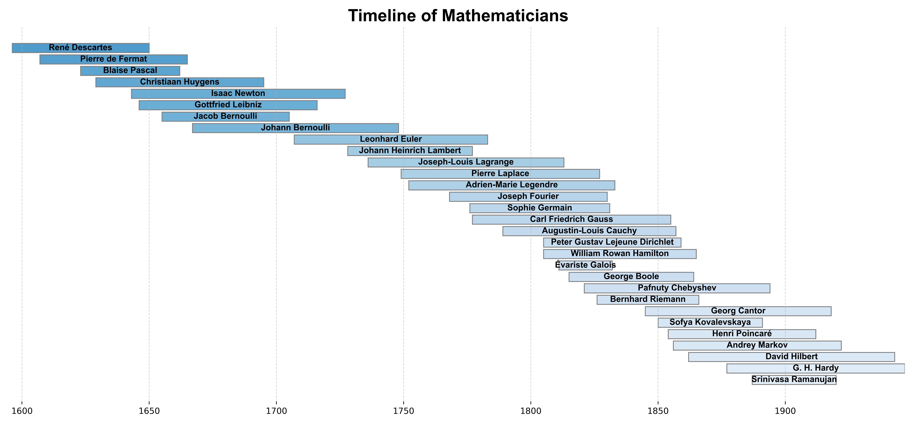

[How one German city developed – and then lost – generations of math geniuses][3]

Carl Friedrich Gauss was at Göttingen between 1795 and 1855
Bernhard Riemann, Felix Klein, Carl Runge, Hermann Minkowski, David Hilbert

James Dow Allen's list of the [Two Hundred Greatest Mathematicians of All Time][5].

[Timeline of mathematics][6]

[1]: https://en.wikipedia.org/wiki/Men_of_Mathematics
[2]: https://mathsab.blogspot.com/2016/05/mathematical-gottingen.html
[3]: https://theconversation.com/how-one-german-city-developed-and-then-lost-generations-of-math-geniuses-106750
[4]: https://www.flickr.com/photos/95869671@N08/32264483720/sizes/l/
[5]: https://fabpedigree.com/james/mathmen.htm
[6]: https://en.wikipedia.org/wiki/Timeline_of_mathematics
