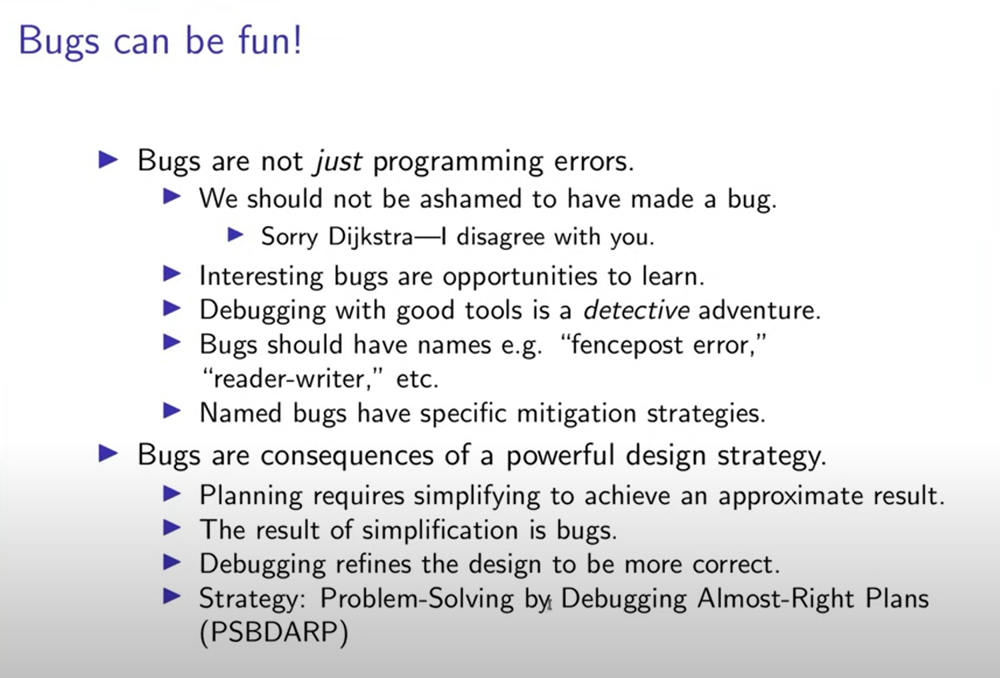

As we learn to code, we build up libraries of components, those can be composed together. We also build up libraries of patches for common types of bugs.

Slide from Gerald Jay Sussman's talk "Programming is (should be) fun!

[1]: 2019-08-29/sources-of-error.html
[2]: https://www.youtube.com/watch?v=2MYzvQ1v8Ww&t=1393s
