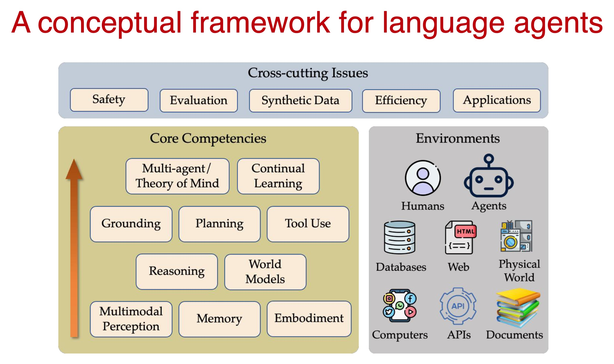

 _Image by [jngai58](https://www.flickr.com/photos/john_n_berk_pics_xyz/51096342158/)_

Notes on [Advanced Large Language Model Agents, Spring 2025][1], an online class that picks up where [Large Language Model Agents MOOC, Fall 2024][2] left off. In the Berkeley catalog, it's [CS294/194-280][12].

## Class Resources

- [LLM Agents Discord][14]

### Instructors

- [Dawn Song][3], Professor, UC Berkeley
- [Xinyun Chen][4], Research Scientist, Google DeepMind
- [Kaiyu Yang][5], Research Scientist, Meta FAIR

### Topics

- Inference-time techniques for reasoning
- Post-training methods for reasoning
- Search and planning
- Agentic workflow, tool use, and functional calling
- LLMs for code generation and verification
- LLMs for mathematics: data curation, continual pretraining, and finetuning
- LLM agents for theorem proving and autoformalization

### Reading

- OpenAI blog [Learning to reason with LLMs][13]
- [The Bitter Lesson][20] by Rich Sutton

## Lecture 1: _Inference-Time Techniques for LLM Reasoning_

[Xinyun Chen][4]
Google DeepMind

Solving real world tasks typically involves a trial-and-error process. Leveraging external tools and retrieving from external knowledge expand LLM's capabilities. Agentic workflows facilitate complex tasks.

- Task decomposition
- allocation of subtasks to specialized modules
- division of labor for collaboration

### “Let’s think step by step”

In chain-of-thought prompting, we allow the model to adapt the amount of computation to the difficulty of the problem. For complex questions, the model can use more reasoning steps. Models can be trained or instructed to use reasoning strategies like decomposition, planning, analogies, etc.

Models can automate prompt design and optimize prompts. They can generate exemplars gaining the benefits of few-shot reasoning without human effort to write examples.

- [Large Language Models Are Human-Level Prompt Engineers][16]
- [Large Language Models As Optimizers][17]
- [Large Language Models As Analogical Reasoners][18]

### Explore multiple branches

We should not limit the LLM to only one solution per problem. Exploring multiple branches allows the LLM to recover from mistakes, generate multiple candidate solutions, or multiple next steps.

#### Self-consistency

Self-consistency is a simple and general principle in which we ask the model for several responses and select the response with the most consistent final answer. Consistency is highly correlated with accuracy.

- [Self-Consistency Improves Chain of Thought Reasoning in Language Models][19]

#### Sample-and-rank

Rather than counting, we can instead select the response with the highest log probability. This performs less well than self-consistency, unless the model has been specifically fine-tuned for this purpose.

She showed a nice example of clustering LLM output in the context of code generation.

#### Tree of thought

Using the LLM to compare or rank candidate solution, or prioritize exploration of more promising partial solutions enables us to:

- increase token budget for a single solution
- increase width to explore the solution space
- increase depth to refine the final solution over many steps

## Lecture 2: _Learning to Self-Improve & Reason with LLMs_

Jason Weston, Meta & NYU

Goal: An AI that "trains" itself as much as possible

- Creates new tasks to train on (challenges itself)
- Evaluates whether it gets them right ("self-rewarding")
- Updates itself based on what it understood

Research question: can this help it become superhuman? Can an LLM improve itself by assigning rewards to its own outputs and optimizing?

### Self-rewarding LMs

#### Observations:

- LLMs can improve if given good judgements on response quality
- LLMs can provide good judgements

#### Train a self-rewarding language model that:

- Has instruction following capability
- Has evaluation capability, i.e., given a user instruction, one or more responses, can judge the quality of responses, aka LLM-as-judge

...then this model can go through an iterative process of data creation/curation training on new data. And, get better at both instruction following and
evaluation in each cycle.

## Lecture 3: On Reasoning, Memory, and Planning of Language Agents

Yu Su, Ohio State University

Memory is important for human mem

### HippoRAG

Uses a learned associative concept map as an index for non-parametric (in context) learning. Large embedding models perform at least as well.

###

Can LLMs learn composition reasoning?

Barack's wife is Michelle. Michelle was born in 1964. When was Barack's wife born?

Comparison?

Trump is 78. Biden is 82. Who is younger?

### Planning

Simplified definition: Given a goal G, decide a sequence of actions (a_0, a_1, ..., a_n) that will lead to a state that passes the goal test g(•).

General trends in planning settings for language agents

- Increasing expressiveness in goal specification, e.g., in natural language as opposed to formal language
- Substantially expanded or open-ended action space
- Increasing difficulty in automated goal test

Language Agents tutorial: https://language-agent-tutorial.github.io/

[1]: https://llmagents-learning.org/sp25
[2]: https://llmagents-learning.org/f24
[3]: https://dawnsong.io/
[4]: https://jungyhuk.github.io/
[5]: https://yangky11.github.io/
[5]: /2024-12-10/llm-agents-mooc.html

[12]: https://rdi.berkeley.edu/adv-llm-agents/sp25
[13]: https://openai.com/index/learning-to-reason-with-llms/
[14]: https://discord.com/channels/1280234300012494859
[16]: https://arxiv.org/abs/2211.01910
[17]: https://arxiv.org/abs/2309.03409
[18]: https://arxiv.org/abs/2310.01714
[19]: https://arxiv.org/abs/2203.11171
[20]: http://incompleteideas.net/IncIdeas/BitterLesson.html

