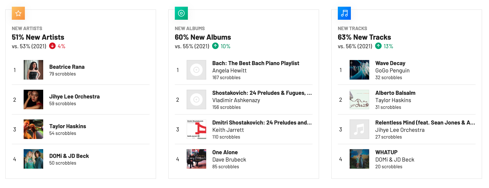

During 2022, as tracked by Last.fm, I listened to 11,509 tracks by 850 different artists.

<figure style="float: right; margin-left: 2em; margin-bottom: 2em; height: 50%; width: 50%; ">
  
</figure>

## Discoveries

My favorite new releases or new discoveries of 2022 were:

- Jihye Lee - Relentless Mind (feat. Sean Jones & Alan Ferber)
- Karel Boehlee, tasteful piano trio
- DOMi & JD Beck - Jazz piano virtuosity and glitchy drumming
-  Taisei Iwasaki - Jazz from Japan
  - MINOR DOLL (feat. Takuya Kuroda)
  - SPACE JAM (feat. Takuya Kuroda)
- GoGo Penguin - Wave Decay
- Shostakovich: 24 Preludes - Recordings by either Keith Jarrett or Vladimir Ashkenazy
- Debussy, performed by Jean-Yves Thibaudet or Pascal Rogé
- Francis Poulenc - Mouvements perpétuels
- Joey Alexander - Origin

## Collecting covers of Aphex Twin songs

Electronic music flourished during the 1990's and early 2000's, producing works of lasting value such as Aphex Twin's _Ambient Works_, Boards of Canada's _Music Has the Right to Children_ and Radiohead’s _Kid A_. It's a tribute to their compositional quality that Aphex Twin tunes have been so often covered across disparate styles - jazzy, Romantic, modernist.

- _Nannou_ The New Talent Jazz Orchestra (featuring Taylor Haskins) 2003
- _Alberto Balsalm_ on Taylor Haskins _Recombination_ (2009)
- _NANNOU_ and _Polynomial - C_ covered by Jazz pianist Dorian Dumont (2021)
- _Avril 14th > Nannou2_ by Brad Walker	Quintet (2014)
- _Flim_ The Bad Plus _These Are the Vistas_ (2003)
- _Avril 14th_ Olga Scheps (2019)
- _Jynweythek Ylow_ Alarm Will Sound (2005). AWS lean into the percussive nature of the work bringing it somewhere in the direction of Bartok or Webern.
- [Rhubarb beautifully arranged for guitar and cello][101] and [Jynweythek Ylow for guitar, mandolin, and cello][102] performed—all intruments—by Youtuber who goes by “Run on Music”.
- [Performances and transcriptions of _Avril 14th_ and _Jynweythek Ylow_ by Megan L. Nell aka Lapsura][103].

[101]: https://www.youtube.com/watch?v=p9aSv8_8JmE
[102]: https://www.youtube.com/watch?v=zYhcA_VLr3o
[103]: https://www.lapsura.com/music/index.php?artist=AFX
