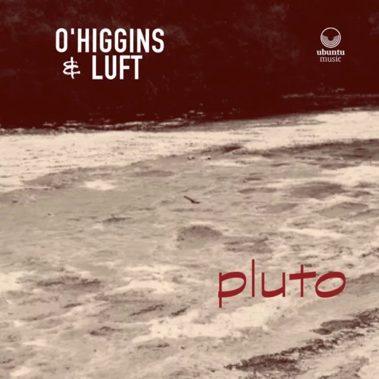

## Hyperion Records

Hyperion Records was one of the last holdouts to not have their catalog available on streaming services.

February 2023, it was acquired by the Universal Music Group and in July their deep and wonderful catalog started appearing on streaming services.

Angela Hewitt
Stephen Hough
Steven Osborne

Víkingur Ólafsson

VISIONS
Anders Miolin

Après Fauré
Brad Mehldau

HOPE (EP)
Bill Laurance

From the North - GoGo Penguin Live in Manchester

Vadym Kholodenko

Jesse Dietschi Trio

Daniel Herskedal

standards _Fruit Galaxy_

Michael Feinberg - Blues Variant

Max Light

## Dorian Dumont

If you've had a years long obsession with Aphex Twin covers on accoustic instruments - and who hasn't? - you might have been a bit giddy when Brussells-based piantist Dorian Dumont released a _second_ album of Aphex Twin covers.

Windowlicker becomes a piano sonata. Dumont's lush and meditative version of Rhubarb is another highlight, infused with scattered raindrops of dissonance precipitated from Bill Evan's Peace Piece.

Electronic glitch morphs into Webyrn-like

## Pluto by O'Higgins & Luft

Saxophonist Dave O’Higgins & guitarist Rob Luft recorded an album of Monk and Coltrane covers in 2018.

Dave O’Higgins / sax
Rob Luft / guitar
Ross Stanley / piano
Misha Mullov-Abbado / bass
Rod Youngs / drums

[1]: https://www.gregreitan.com/
[2]: https://sunnysiderecords.com/site/release_detail?id=1208
[3]: https://www.daveohiggins.com/ohiggins-luft

