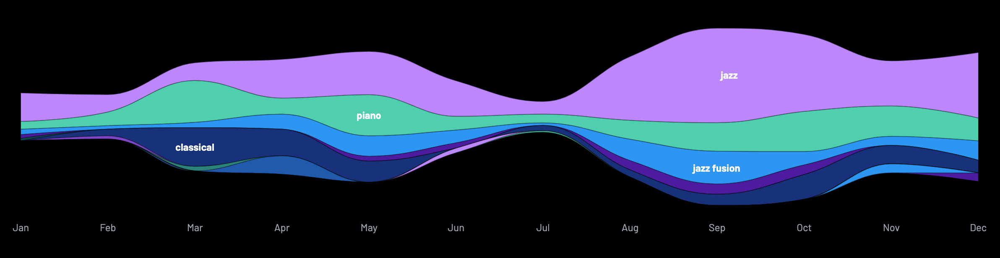
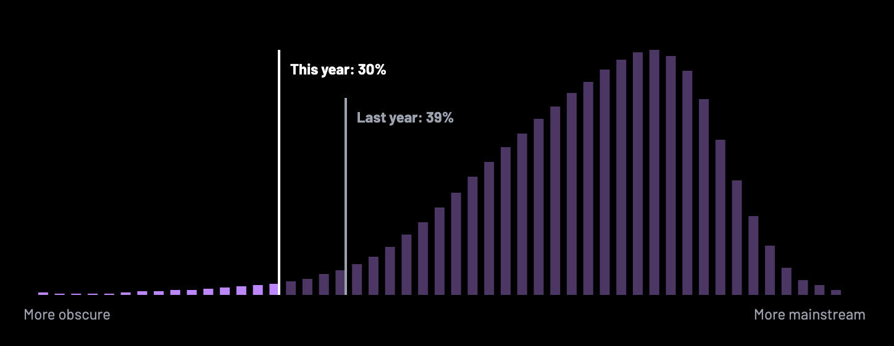

<figure>
  
  <figcaption style="font-size: small; font-style: italic;">Although few could tell the difference, this is not actually an image of me enjoying some tunes in my study, but rather a nefarious piece of AI slop! Specifically, “A scholarly older gentleman in the style of a medieval illuminated manuscript wearing headphones.” (by DALL·E)</figcaption>
</figure>

What a great year for music, with an abundance of new releases and newly discovered goodies. We recommend queuing up the [2024 playlist][25] before reading further.

<figure style="float: right; margin-left: 2em; margin-bottom: 2em; height: 50%; width: 50%; ">
  
</figure>

Streaming services are so good for exploratory listening. Following the threads of “if you like this, you’ll probally like that...” will lead you down some very enjoyable rabbit holes.

On the other hand, it remains to be seen whether streaming music is sustainable for musicians or even technology companies. [Enshitification][6] is taking hold. Platforms are being flooded with [ghost music][7], [fake artists][8], and AI generated dreck. In the race to the bottom, [you can’t outrun spotify][9]. It's a bit hillarious that technology people, myself included, spent so many years throwing around the word “disintermediation” only to devolve into online middlemen and virtual robber barrons - Amazon, Spotify, Uber, etc... One day, all will be replaced by open protocols and optimized for human flourishing rather than “engagement” which is a proxy for addiction and ad revenue.

For now, like ocean currents washing up pretty shells onto golden beaches, the algorithms surface plenty of organic hand-crafted tunes and I am grateful to our digital overlords for that.

## Live music

One way to be sure you're getting real human-generated content is to go see it being made in person. Showing up and dropping a bit of disposable income on tickets, drinks, and snacks helps keep the scene alive and let's creative folks know you value what they do. I'm old and lame and don't get out much, but I saw some good shows this year.

There were a few pleasant Sunday afternoons spent taking in a jazz set at [Undercurrent Books](https://www.undercurrent.nz/). Esperanza Spalding graced the 2024 Wellington Jazz Festival. Japanese math-rock legends _Toe_ closed out their APAC tour to a packed house at Meow. Louisa Williamson's _Heavy Flow_ series of shows feature a rotating cast of very talented Wellington musicians having fun. I finally got out to the last one of 2024.

While visiting [Toronto][5], I briefly became a regular at [the Rex][10]. I grooved out to a couple of piano trios, one consisting of Duncan Wilson (p.), Chris Parnis (b.) and Petros Anagnostakos (d.), and a second trio led by bassist [Jesse Dietschi][11]. I keep coming across solid bassist-led jazz ensembles, for instance [Ben Wolfe][13], [Michael Janisch][12], and [Michael Feinberg][14]. You can hear the Jess Dietschi Trio's thoughtful chamber jazz on their 2023 album _Gradient_, which I highly recommend.

In Toronto's lovely Koerner Hall, I took in a recital of Handel, Beethoven, and Prokofiev performed by Vadym Kholodenko, sort of a journey through time from baroque to high classical to modern.

## Hyperion Records

Speaking of classical, [Hyperion Records][26] was one of the last holdouts regarding streaming. In February of 2023, Hyperion was acquired by the Universal Music Group and in the later half of that year their deep and wonderful catalog started appearing on streaming platforms.

It's hard to do justice to this trove of music, but, for me, one highlight is Angela Hewitt's gorgeous piano playing. She's known for Bach, but there's so much more, in particular her sweetening of Ravel's sometimes harsh piano works. Stephen Hough's playing of Mompou and Lívia Rév's of Debussy are also top notch.

Are Universal and the streaming platforms strip-mining a lovingly crafted body of work improverishing the creators and curators in the bargain? I truly hope an economic model emerges that rewards the best in human creativity and enables ‘musician’ to be a viable profession. In the meantime, hearing this music has certainly enriched my small corner of the world.

## New releases

A lot of great music came out this past year. Below is a list of those that, for whatever reason, resonated with me. If an AI apocalypse is coming to destroy music, it hasn't hit just yet. If we discount the possibility that we're all living in a simulation, I'm pretty sure all of the following are real live human musicians.

- _Living 12 Strings_ - Anders Miolin
- _Mid Spiral_ - BADBADNOTGOOD
- _The Understated_ - Ben Wolfe
- _HOPE_ - Bill Laurance
- _Bloom_ - Bill Laurance, The Untold Orchestra & Rory Storm
- _Keeping Company_ - Bill Laurance & Michael League
- _Après Fauré_ - Brad Mehldau
- _Call For Winter II: Resonance_ - Daniel Herskedal
- _Echoes of Solitude_ - Daniel Herskedal, Mattia Vlad Morleo
- _To the APhEX_ - Dorian Dumont
- _Spirit Box_ - Flying Lotus
- _From the North_ - GoGo Penguin Live in Manchester
- _The Bounding Line_ - Greg Reitan
- _In A Landscape_ - Max Richter
- _Moodial_ - Pat Metheny
- _Code Derivation_ - Robert Glasper: _Wake Up_ is a great song.
- _Fruit Galaxy_ - standards
- _Complex Emotions_ - The Bad Plus: I especially like the song _French Horns_ from the new guitar-driven Bad Plus.
- _Now I See The Light_ - Toe
- _Continuum_ - Víkingur Ólafsson: Icelandic pianist Víkingur Ólafsson followed up a 2023 recording of Bach's _Goldberg Variations_ with a 6-song EP of selected Bach pieces. To all who caught Ólafsson's tour last year, I am deeply envious.
- _Standards_ - Yotam Silberstein

### Dorian Dumont

If you've had a years-long obsession with Aphex Twin covers on accoustic instruments (_and who hasn't?_) you might have been a bit giddy when Brussells-based piantist [Dorian Dumont][16] released a _second_ album of Aphex Twin covers. Dumont's lush and meditative version of Rhubarb is a highlight, infused with scattered raindrops of dissonance precipitated from Bill Evan's Peace Piece. Windowlicker morphs into a banger of a piano sonata. Though I'm a dedicated techno-enthusiast, something appeals to me about the idea of reclaiming electronic music to the organic. Humans can still hold our own with the machines.

## Following threads, new Discoveries

Following the connections to discover new music is fun, even if it's not necessarily new, just new to me. For example, Seattle native pianist Aaron Parks played on saxophonist Dayna Stephens’ 2015 album _Reminiscent_ who plays on the tracks _Minority_ and _Infant Eyes_ on Victor Gould’s [In Our Time][4], which is an album that keeps growing on me. Victor Gould is in Black Art Jazz Collective who released the very solid _Truth to Power_ in 2024.

Robert Glasper and Nicholas Britell collaborated on the soundtrack to an HBO series called “The Winning Time Sessions”. Apparently, the show is about basketball, a sport I was so bad at, my middleschool coach told me to go back to my skateboard. These bite-sized groove-oriented tracks will help you bang out some code. A short click away, you'll find Britell’s tender soundtrack for “If Beale Street Could Talk”.

I've been a math rock nerd for some time, falling hard for Tricot, Rega, Toe, Covet, Piglet, Floral, Don Caballero, Tortoise, Fago Sepia... So, I a bit flummoxed as to how I missed Japanese math rockers Hyakkei. Luckily, my 17-year-old is developing an ear for good music and said I would like them. Yep, I do.

### O'Higgins & Luft

Saxophonist Dave O’Higgins & guitarist Rob Luft recorded an excellent album of Monk and Coltrane covers in 2018 and followed that up with the equally good _Pluto_ in 2022.

### Chosen jazz

Early in the year, guitarist Gilad Hekselman put out an excellent cover of Coltrane's _Equinox_. Following the “you might also likes” led to a whole slew of incredible Isreali jazz musicians including guitarist Yotam Silberstein, and pianists Yaron Herman, Nitai Hershkovits and Anat Fort. Fort’s piece “First Rays” from the 2016 release [_Birdwatching_ by Anat Fort Trio with Gianluigi Trovesi][15] is quite good.

The _Garden Suite_ by Nitai Hershkovits & Daniel Dor is a unique piece of music. If Frank Zappa and Aphex Twin had collaborated on the soundtrack to a Studio Ghibli film, it might sound something like this.

### Labels

No streaming platform that I know of does a good job of representing record labels, which is a shame. A good labels curates a stable of musicians that cohere. I found drummer, sax player,  and band leader Karl-Henrik Ousbäck through [Fresh Sound Records][]. They've also put out music by Ari Hoenig, Tom Ollendorff, George Colligan, and Simon Moullier among others. Other labels worth checking out include [ECM][20], [Blue Note][22], [Criss Cross][17], [Sunnyside Records][18], [Origin Records][19], [Edition Records][23], and [ACT][21]. If the algorithms don't serve up the good stuff, go to the source.

## Analysis paralysis

[Last.fm][24] gives some nice end-of-year listening analysis. Apparently, I had poor listening stamina in January through February and again in July. Next year, I'll do better.

Glad to see that I was 9% more obscure in 2024 than my already obscure self of 2023. I just keep moving out into that long tail of “nobody gets that weird shit you listen to.”

## Happy 2025

Whether the coming year finds us hiding underground from the all seeing eye of Skynet or transcending our Earthly bonds to become beings of light in rapturous singularity, happy listening in 2025.

[1]: https://www.gregreitan.com/
[2]: https://sunnysiderecords.com/site/release_detail?id=1208
[3]: https://www.daveohiggins.com/ohiggins-luft
[4]: https://www.victorgouldmusic.com/product/In-Our-Time
[5]: https://cbare.github.io/2024-05-11/toronto.html
[6]: https://www.ft.com/content/6fb1602d-a08b-4a8c-bac0-047b7d64aba5
[7]: https://harpers.org/archive/2025/01/the-ghosts-in-the-machine-liz-pelly-spotify-musicians/
[8]: https://www.honest-broker.com/p/the-fake-artists-problem-is-much
[9]: https://www.vulture.com/article/spotify-mood-music-review.html
[10]: https://www.therex.ca/
[11]: https://jessedietschi.com/
[12]: https://www.michaeljanisch.com/
[13]: https://benwolfe.com/
[14]: https://www.mfbass.com/
[15]: https://www.anatfort.com/album/birdwatching/
[16]: https://ebbmusic.eu/artists/dorian-dumont/
[17]: https://www.crisscrossjazz.com/
[18]: https://www.sunnysiderecords.com/
[19]: https://originarts.com/about_origin.php
[20]: https://ecmrecords.com/
[21]: https://www.actmusic.com/en/
[22]: https://www.bluenote.com/
[23]: https://editionrecords.com/
[24]: https://www.last.fm/user/cbare
[25]: https://music.apple.com/us/playlist/2024-playlist/pl.u-76oNl2mTNqRGrx
[26]: https://www.hyperion-records.co.uk/
