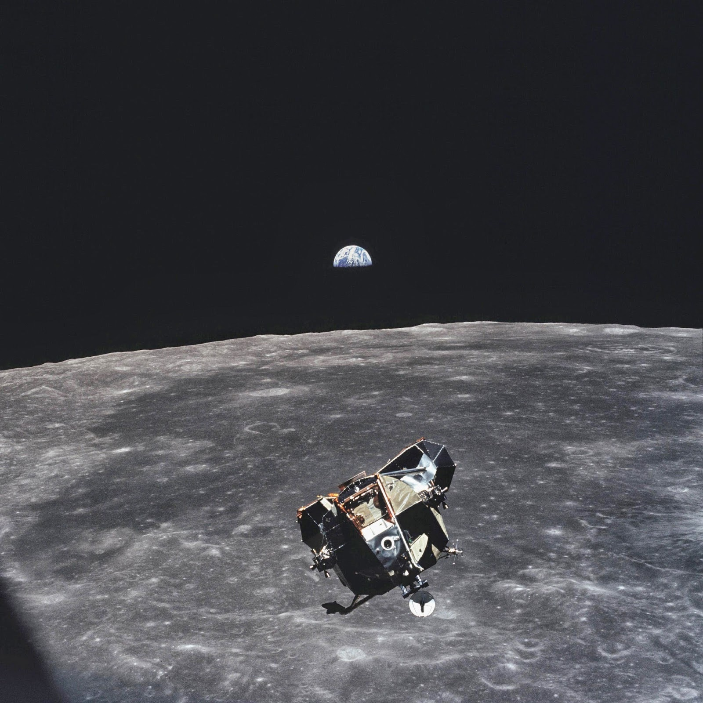
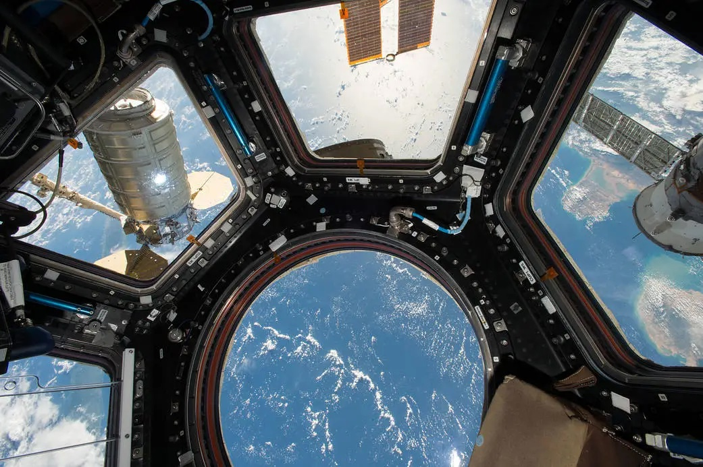

_“All your dreams of adventure and freedom and discovery culminate...and then you go nowhere but round and round with the same old thoughts going round and round with you.”_

_Orbital_ by Samamtha Harvey is a beautiful and contemplative book. It's a book in which nothing much happens, part of a growing subgenre of such books. The book reaches its climax when all the characters are asleep. Yet, the book covers some important topics - birth, death, new love blossoming, old love fading, climate change, the insignificance of humans and of humanity in total, political division, religion, simple bonds of shared experience... all the important topics.

_“Our lives here are inexpressibly trivial and momentous at once...”_

For those wondering where the plot is, it's right here:

_“A human being was not made to stand still.”_

## A book of vivid images

There are a few images that play a role in the book. The first is a 1656 painting by Diego Velázquez called _Las Meninas_, which is used to discuss perspective.

Michael Collins, the astronaut who took this photo of the Lunar Module from the Apollo 11 mission in 1969, is the only human, alive or dead that isn't in the frame of this picture.

The Earth from the International Space Station.

_Orbital_ is a love letter to our home planet, “a celebration of the Earth [...] with a pang of loss.” It's the change of perspective that many of us need right now.

## More about _Orbital_

- [Everything you need to know about Orbital by Samantha Harvey, winner of the Booker Prize 2024][1]
- [It’s Harder to See the World’s Problems From 250 Miles Up][2], NYTimes
- [‘I’m so not an astronaut!’ Samantha Harvey on her Booker-winning space novel – and the anxiety that drove it][3], The Guardian
- [NYTimes Book Club][4]

[1]: https://thebookerprizes.com/the-booker-library/features/everything-you-need-to-know-about-orbital-booker-prize-2024-winner
[2]: https://www.nytimes.com/2023/12/05/books/review/orbital-samantha-harvey.html
[3]: https://www.theguardian.com/books/2024/nov/13/samantha-harvey-interview-booker-winning-novel-orbital
[4]: https://www.nytimes.com/2025/01/31/books/review/orbital-samantha-harvey-book-club.html
