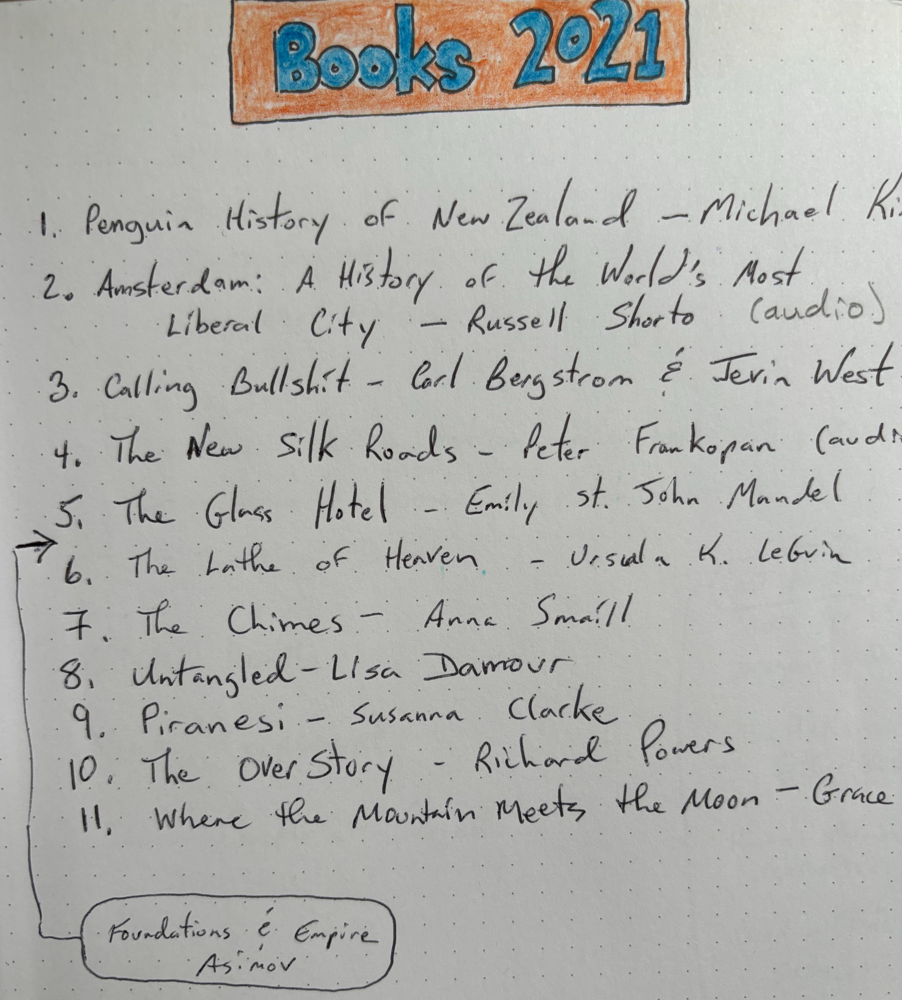

- Penguin History of New Zealand - Michael King
- Amsterdam: A History of the World's Most Liberal City - Russell Shorto (audio)
- Calling Bullshit - Carl Bergstrom & Jevin West
- The New Silk Roads - Peter Fankopan (audio)
- The Glass Hotel - Emily St. John Mandel
- Foundation and Empire - Isaac Asimov
- The Lathe of Heaven - Ursula K. LeGuin
- The Chimes - Anna Smaill
- Untangled - Lisa Damour
- Piranesi - Susanna Clarke
- The Overstory - Richard Powers
- Where the Mountain Meets the Moon - Grace Lin (to Henry)

See also, [Books 2020](/2021-01-17/books-2020.html) and [GoodReads](https://www.goodreads.com/user/show/22238686-christopher-bare)
