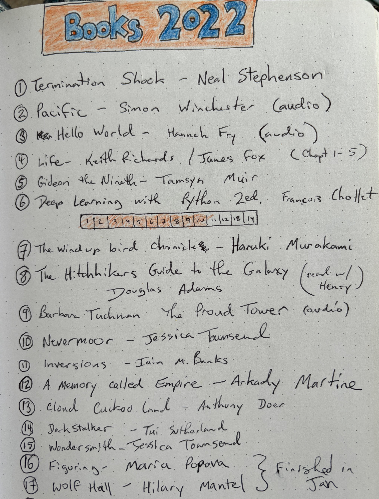

- Termination Shock - Neal Stephenson
- Pacific - Simon Winchester (audio)
- Hello World - Hannah Fry (audio)
- Life - Keith Richards and Jamie Fox (Chapt. 1-5)
- Gideon the Ninth - Tamsyn Muir
- The Hitchhiker's Guide to the Galaxy - Douglas Adams (to Henry)
- Deep Learning with Python, 2nd Ed. - François Chollet
- The Proud Tower - Barbara W. Tuchman (audio)
- The Wind-Up Bird Chronicle - Haruki Murakami
- Nevermoor: The Trials of Morrigan Crow - Jessica Townsend (to Henry)
- Inversions - Iain M. Banks
- A Memory Called Empire - Arkady Martine (Oct book club)
- Cloud Cuckoo Land - Anthony Doerr (Nov book club)
- Figuring - Maria Popova (audio)
- Wolf Hall - Hilary Mantel (started)

See also, [Books 2021](/2021-12-31/books-2021.html) and [GoodReads](https://www.goodreads.com/user/show/22238686-christopher-bare)
