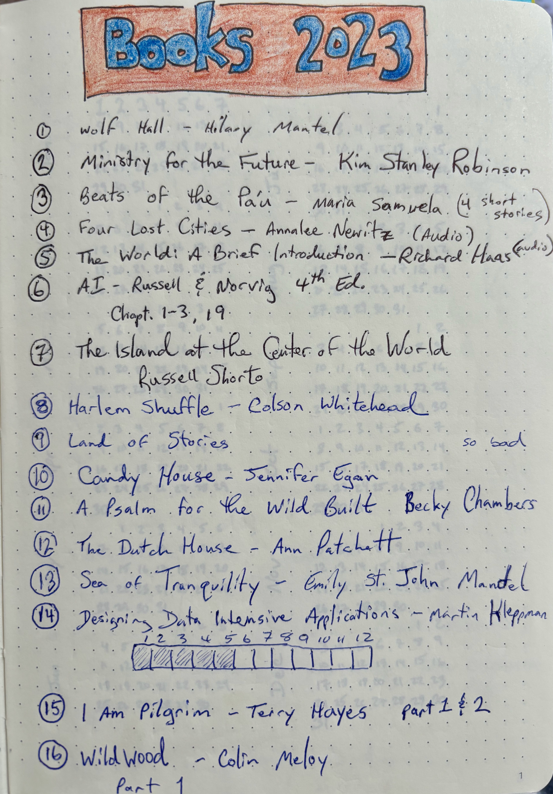

- Wolf Hall - Hilary Mantel
- Ministry for the Future - Kim Stanley Robinson
- Beats of the Pa'u - Maria Samuela
- Four Lost Cities - Anna Newitz (audio)
- The World: A brief Introduction - Rihard Haas (audio)
- [AI: A Modern Approach, 4th Ed.][2] - Russell and Norvig (Chapt. 1,2,3,19)
- The Island at the Center of the World - Russel Shorto
- Harlem Shuffle - Colson Whitehead
- Candy House - Jennifer Egan
- A Psalm for the Wild Build - Becky Chambers
- The Dutch House - Ann Patchet
- Sea of Tranquility - Emily St. John Mandel
- [Designing Data Intensive Applications][1] - Martin Kleppmann
- I am Pilgrim - Terry Hayes (parts 1 & 2)
- Wildwood - Colin Meloy (part 1)

See also, [Books 2022](/2023-01-01/books-2022.html) and [GoodReads](https://www.goodreads.com/user/show/22238686-christopher-bare)

[1]: https://dataintensive.net/
[2]: https://aima.cs.berkeley.edu/
