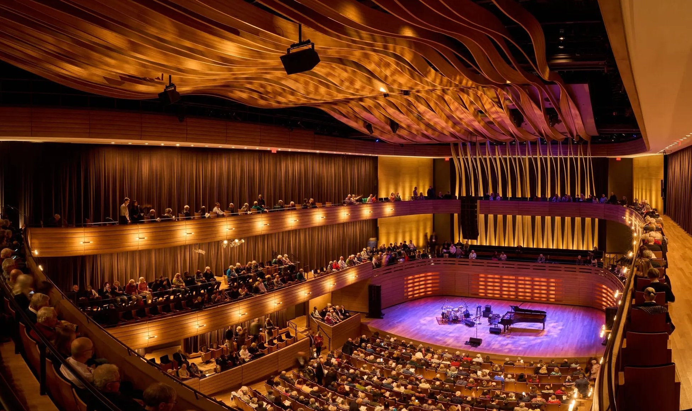

<figure>
    
    <figcaption style="font-size: small; font-style: italic;">Gooderham Building Toronto - Photo by Jack Landau</figcaption>
</figure>

[Toronto][7] is the largest city in Canada and 4th largest in North America, with a population of 3 million. The greater Toronto area is home to 6.7 million of Canada's 39 million people. Founded as York in 1793 on [the north shore of Lake Ontario][21] and renamed Toronto in 1834, the city is a center of finance and media and a [major technology hub][8].

I'm going to be in Toronto for two weeks in July for the [Deep Learning + Reinforcement Learning Summer School][30] at the [Vector Institute][31] and the Canadian Institute for Advanced Research (CIFAR).

Here are the notes I collected for this time and next on how to enjoy a nice visit to Toronto.

<!-- {:style="float: right; height: 55%; width: 55%; margin-left: 1em; margin-top: 2em;"} -->

<figure style="float: right; height: 55%; width: 55%; margin-left: 1em; margin-top: 2em;">
    
    <figcaption style="font-size: small; font-style: italic;">Schwartz Reisman Innovation Campus</figcaption>
</figure>

## Travel Guides

- [NY Times 36 hours in Toronto][1]
- [Eugene Levy’s Toronto][2]
- [Lonely Planet's guide to Toronto][9]
- [WikiVoyage Toronto][14]
- [BlogTO's 35 things to do in Toronto this summer][39]
- [Culture Trip Toronto][47]

## Things to see

Toronto has some [architecturally cool buildings][32].

### Map links

- [Toronto][111]
- [CN Tower][104]
- [Casa Loma][105]
- [Distillery District][108]
- [Gooderham Building][109]
- [Graffiti Alley][106]
- [High Park][102]
- [Queen's Park][110]
- [Scarborough Bluffs][103]
- [St Lawrence Market][107]

### Museums

- Art Gallery
- Royal Ontario Museum
- Gardiner Museum

### Nearby

- [Beaches][11]
- [The Toronto Islands][25]
- Niagara Falls
- Georgian Bay Biosphere Reserve

## Music

There are a bunch of music venues that look to be worth checking out.

- [The Rex Hotel Jazz and Blues Bar][3]
- [Jazz Bistro][5]
- Eugene Levy says “the acoustics are impeccable” at [The Royal Conservatory of Music][4]'s Koerner Hall. Pianist [Vadym Kholodenko performs on July 18, 2024 at 7:30 PM][20].
- There are outdoor shows on Thursdays and Sundays during summer at the [Toronto Music Garden][18] by the waterfront.

Toronto based musicians:

- Guitarist [Chris Platt][19].
- [Allison Au][26] is performing with guitarist [Rob Chapman][37] and bassist Jonathan Meyer at Hirut Cafe on [July 16, 2024 at 8:00 PM][38].
- [Emily Steinwall][42].

For next time: The [Toronto Jazz Festival][27] runs for 10 days at the tail end of June. [Roy Thomson Hall][41] is home to the Toronto Symphony Orchestra. Too bad summer is their off season.

## Theater

- [Second City Toronto][13] comedy club.
- [Canadian Stage][17] puts on Shakespeare performances in High Park Amphitheatre. Sadly not during the time I'll be in Toronto.
- [Toronto Fringe Festival][40] runs July 3 - 14

## Books and book stores

The [Toronto Guardian][45] has a nice list of [the best bookstores in Toronto][43]. Culture trip lists [the best used bookstores][46].

- [Bakka Phoenix Books][44], Canada’s oldest science fiction and fantasy bookstore
- [Balfour Books][50], used books
- [BMV][49], used and discount books

### Books

- [The Living Great Lakes: Searching for the Heart of the Inland Seas][24]
Jerry Dennis

### Canadian Writers

Why not read some [books][34] by [Canadian authors][33]?

- [Margaret Atwood][36]
- [Emily St. John Mandel][35]
- Alice Munro
- Michael Ondaatje
- [Cory Doctorow][51]

## Eating

- [Rasa](https://www.rasabar.ca/)
- [Chubby's Jamaican](https://chubbysjamaican.com/)
- Richmond Station
- St Lawrence Market

- [Bloor-Yorkville restaurants][48]

## Getting around

- [Bike Share Toronto][10]
- [GO transit system][15]

## News

The [Toronto Star][201] and [The Globe and Mail][202] are Canada's most widely read newspapers.

## City of Toronto 1876

{:style="margin: 0px 18px 18px 18px;"}

[1]: https://www.nytimes.com/interactive/2024/04/11/travel/things-to-do-toronto.html
[2]: https://www.nytimes.com/2024/05/09/travel/eugene-levy-toronto.html
[3]: https://www.therex.ca/events/
[4]: https://www.rcmusic.com/events-and-performances
[5]: https://jazzbistro.ca/event-calendar/
[6]: https://www.gardinermuseum.on.ca/
[7]: https://en.wikipedia.org/wiki/Toronto
[8]: https://www.nytimes.com/2022/03/21/technology/toronto-tech-boom.html
[9]: https://www.lonelyplanet.com/canada/toronto
[10]: https://bikesharetoronto.com/
[11]: https://www.lonelyplanet.com/articles/best-beaches-toronto
[12]: https://1000islandskayaking.com/
[13]: https://www.secondcity.com/shows
[14]: https://en.wikivoyage.org/wiki/Toronto
[15]: https://www.gotransit.com/en/system-map
[16]: https://torontopianoteachers.ca/toronto-piano-practice-rooms
[17]: https://www.canadianstage.com/shows-events/calendar/
[18]: https://harbourfrontcentre.com/series/summer-music-in-the-garden/
[19]: https://www.chrisplattmusic.ca/gigs
[20]: https://www.rcmusic.com/events-and-performances/tsm-presents-vadym-kholodenko
[21]: https://www.tclf.org/places/view-city-and-regional-guides/toronto/torontos-landscape-legacy
[22]: https://www.cntower.ca/
[23]: https://casaloma.ca/
[24]: https://jerrydennis.net/store/products/the-living-great-lakes-searching-for-the-heart-of-the-inland-seas
[25]: https://www.torontoisland.com/
[26]: https://www.allisonau.com/
[27]: https://torontojazz.com/
[30]: https://vectorinstitute.swoogo.com/dlrlss2024/
[31]: https://vectorinstitute.ai/
[32]: https://www.blogto.com/slideshows/top-buildings-toronto/
[33]: https://www.goodreads.com/shelf/show/canadian-authors
[34]: https://www.cbc.ca/books
[35]: https://www.emilymandel.com/
[36]: https://margaretatwood.ca/
[37]: https://robertchapmanmusic.com/
[38]: https://www.hirutjazz.ca/
[39]: https://www.blogto.com/radar/2024/06/things-do-toronto-summer-2024/
[40]: https://fringetoronto.com/
[41]: https://roythomsonhall.mhrth.com/
[42]: https://emilysteinwall.bandcamp.com/
[43]: https://torontoguardian.com/2023/07/the-best-bookstores-in-toronto/
[44]: https://www.bakkaphoenixbooks.com/
[45]: https://torontoguardian.com/
[46]: https://theculturetrip.com/north-america/canada/articles/7-of-the-best-used-bookstores-in-toronto
[47]: https://theculturetrip.com/north-america/canada/toronto
[48]: https://torontolife.com/food/bloor-yorkville-restaurant-crawl/
[49]: https://www.bmvbooks.com/
[50]: http://balfourbooks.squarespace.com/
[51]: https://pluralistic.net/

[101]: https://maps.app.goo.gl/Etus9evvkdKbZNmx7
[102]: https://maps.app.goo.gl/YVnRLASZARTf7z6q6
[103]: https://maps.app.goo.gl/6zLCckLE435sUsZXA
[104]: https://maps.app.goo.gl/FKFSZxnC3BX6DxHZ8
[105]: https://maps.app.goo.gl/HbqQofrEbJ1qd2Ty6
[106]: https://maps.app.goo.gl/QyLGLfKQKrM63N1j8
[107]: https://maps.app.goo.gl/oYfTqHJTC6Yjf5qYA
[108]: https://maps.app.goo.gl/hXkiEAt24NyF3pwt8
[109]: https://maps.app.goo.gl/7eXoYHg57W9PWnBT9
[110]: https://maps.app.goo.gl/SffeDaBaZKk7Wkwi6
[111]: https://maps.app.goo.gl/qhTM6RSv3ynxRfh46

[201]: https://www.thestar.com/
[202]: https://www.theglobeandmail.com/
