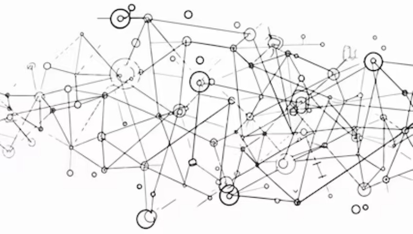

Now and then, the right mix of creative people come together in favorable conditions and something special happens. They begin riffing off each other, learning from and building on each other’s work. When everything lines up just right, the result is an intellectual and artistic efflorescence, humans at their most creative.

[Brian Eno][1] coined a term for this: “Scenius stands for the intelligence and the intuition of a whole cultural scene. It is the communal form of the concept of the genius.”

[Kevin Kelly writes][3], the geography of scenius is nurtured by several factors:

- **Mutual appreciation** — Risky moves are applauded by the group, subtlety is appreciated, and friendly competition goads the shy. Scenius can be thought of as the best of peer pressure.
- **Rapid exchange of tools and techniques** — As soon as something is invented, it is flaunted and then shared. Ideas flow quickly because they are flowing inside a common language and sensibility.
- **Network effects of success** — When a record is broken, a hit happens, or breakthrough erupts, the success is claimed by the entire scene. This empowers the scene to further success.
- **Local tolerance for novelties** — The local “outside” does not push back too hard against the transgressions of the scene. The renegades and mavericks are protected by this buffer zone.

When I was first working in the Bay Area, I found that there were two types of smart people. There were smart people that made you feel dumb and useless. And then, there were smart people that, if only for a moment, lifted you up to their level. You could see further and do more in their proximity. I decided, as much as possible, to gravitate toward the latter type.

A few key individuals of exceptional talent and the right mindset can anchor a scene that grows and sustains itself. In a small way, all you need is a few people being in flow together. The key is that it's a shared experience. “Genius is individual, scenius is communal.”

Where do you see creative things happening around you that need support or nurturing? We should all look for ways to help virtuous cycles start spinning.

## Famous examples

- New York City jazz scene of the 1950s
- Paris in the 1920s
- Mathematics at the University of Göttingen
- Physics in the early 20th century
- The Lunar Society
- The Viennese Classical Period
- Rock climbers at Camp 4 in Yosemite
- The Algonquin Round Table
- The Harlem Renaissance
- Bell Labs
- Xerox PARC
- Silicon Valley
- Florence during the Renaissance
- Baghdad's House of Wisdom

[1]: https://www.brian-eno.net/about/
[2]: https://www.theguardian.com/music/2010/apr/28/brian-eno-brighton-festival
[3]: https://kk.org/thetechnium/scenius-or-comm/
[4]: https://austinkleon.com/2023/09/12/maps-of-scenius/
[5]: https://www.newyorker.com/magazine/2014/07/07/ambient-genius
