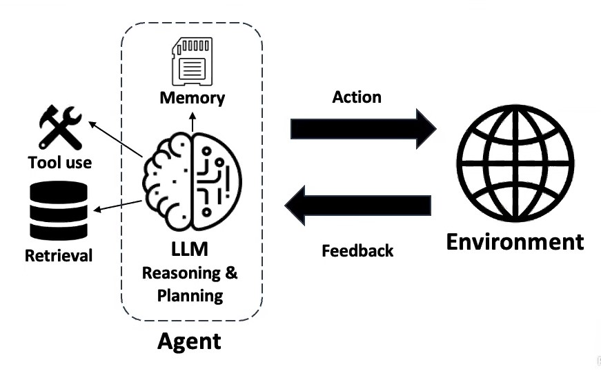
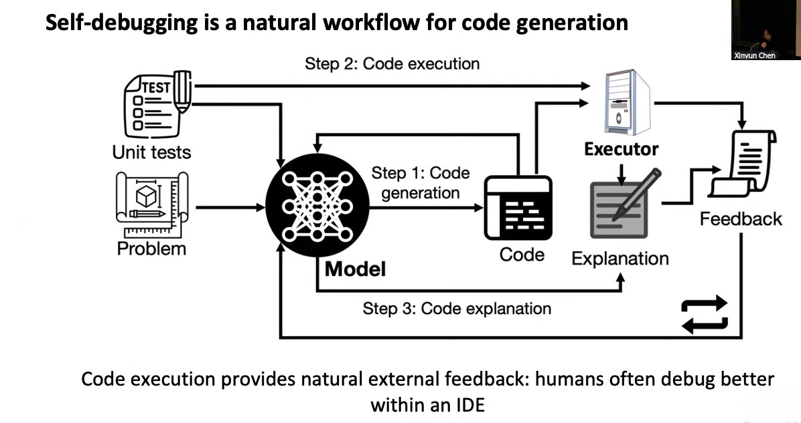
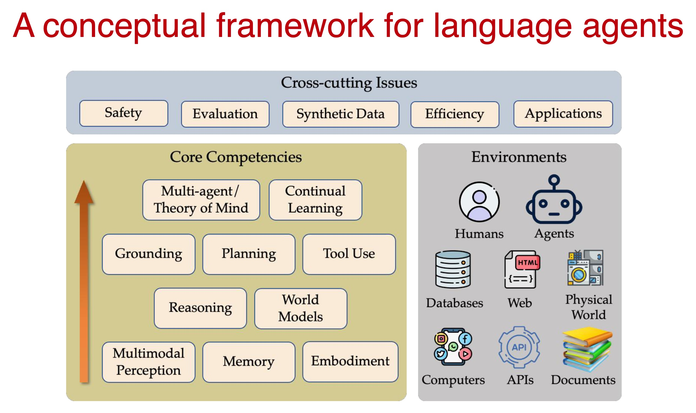
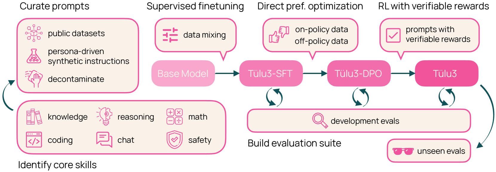
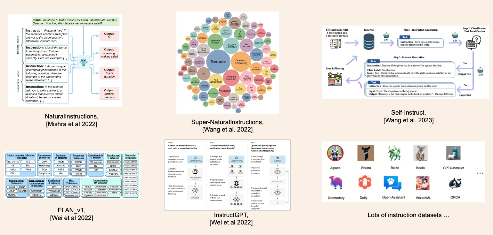
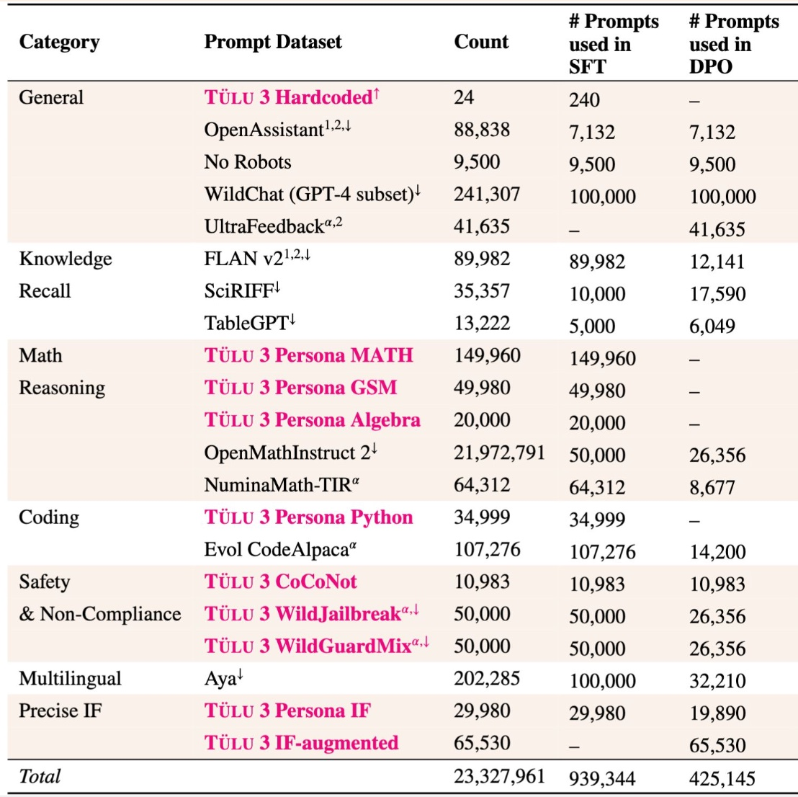
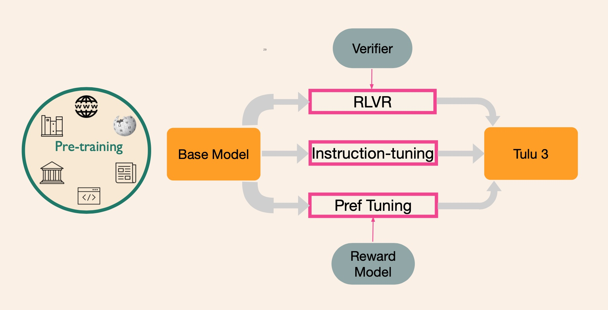
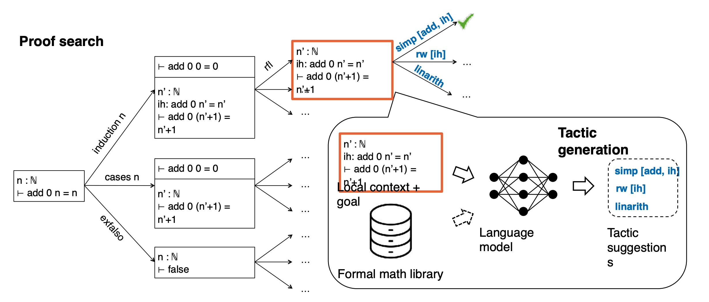

 _Image by [jngai58](https://www.flickr.com/photos/john_n_berk_pics_xyz/51096342158/)_

Notes on [Advanced Large Language Model Agents, Spring 2025][1], an online class that picks up where [Large Language Model Agents MOOC, Fall 2024][2] left off. In the Berkeley catalog, it's [CS294/194-280][12].

## Advanced LLM Agents MOOC

The _Advanced LLM Agents_ course surveys twelve topics in current research focusing on reasoning, tool use, post-training and inference-time techniques, with applications spanning coding, mathematics, web interaction, and scientific discovery. Going beyond text completion, these models operate in workflows - planning, exploring, and evaluating iteratively.

Training has evolved towards staged recipes. Curated reasoning traces on tasks with verifiable outputs — code and math — serve as grounded reward signals for reinforcement learning, augmenting human feedback.

At inference time, models are augmented with retrieval, memory systems, and tool integration. Reasoning strategies such as chain-of-thought prompting and tree-based search allow models to decompose problems, explore solution spaces and self-correct.

Finally, the course underscores the convergence of LLMs with formal reasoning and scientific discovery. Systems like lean, a mathematical programming language and theorem prover, provide rigor with while LLMs supply intuition and abstraction - a powerful combination.

Yet, as model capabilities increase, so does the potential for exploitation. The final lecture promotes security principles for safely deploying increasingly powerful agentic agents.

### Instructors

- [Dawn Song][3], Professor, UC Berkeley
- [Xinyun Chen][4], Research Scientist, Google DeepMind
- [Kaiyu Yang][5], Research Scientist, Meta FAIR

### Topics

- Inference-time techniques for reasoning
- Post-training methods for reasoning
- Search and planning
- Agentic workflow, tool use, and functional calling
- LLMs for code generation and verification
- LLMs for mathematics: data curation, continual pretraining, and finetuning
- LLM agents for theorem proving and autoformalization

### Reading

- OpenAI blog [Learning to reason with LLMs][13]
- [The Bitter Lesson][20] by Rich Sutton

### Class Resources

- [LLM Agents Discord][14]

## Lecture 1: _Inference-Time Techniques for LLM Reasoning_

[Xinyun Chen][4]
Google DeepMind

Solving real world tasks typically involves a trial-and-error process. Leveraging external tools and retrieving from external knowledge expand LLM's capabilities. Agentic workflows facilitate complex tasks.

- Task decomposition
- allocation of subtasks to specialized modules
- division of labor for collaboration

### “Let’s think step by step”

In chain-of-thought prompting, we allow the model to adapt the amount of computation to the difficulty of the problem. For complex questions, the model can use more reasoning steps. Models can be trained or instructed to use reasoning strategies like decomposition, planning, analogies, etc.

Models can automate prompt design and optimize prompts. They can generate exemplars gaining the benefits of few-shot reasoning without human effort to write examples.

- [Large Language Models Are Human-Level Prompt Engineers][16]
- [Large Language Models As Optimizers][17]
- [Large Language Models As Analogical Reasoners][18]

### Explore multiple branches

We should not limit the LLM to only one solution per problem. Exploring multiple branches allows the LLM to recover from mistakes, generate multiple candidate solutions, or multiple next steps.

#### Self-consistency

Self-consistency is a simple and general principle in which we ask the model for several responses and select the response with the most consistent final answer. Consistency is highly correlated with accuracy.

- [Self-Consistency Improves Chain of Thought Reasoning in Language Models][19]

#### Sample-and-rank

Rather than counting, we can instead select the response with the highest log probability. This performs less well than self-consistency, unless the model has been specifically fine-tuned for this purpose.

She showed a nice example of clustering LLM output in the context of code generation.

#### Tree of thought

Using the LLM to compare or rank candidate solution, or prioritize exploration of more promising partial solutions enables us to:

- increase token budget for a single solution
- increase width to explore the solution space
- increase depth to refine the final solution over many steps

## Lecture 2: _Learning to Self-Improve & Reason with LLMs_

Jason Weston, Meta & NYU

Goal: An AI that "trains" itself as much as possible

- Creates new tasks to train on (challenges itself)
- Evaluates whether it gets them right ("self-rewarding")
- Updates itself based on what it understood

Research question: can this help it become superhuman? Can an LLM improve itself by assigning rewards to its own outputs and optimizing?

### Self-rewarding LMs

#### Observations:

- LLMs can improve if given good judgements on response quality
- LLMs can provide good judgements

#### Train a self-rewarding language model that:

- Has instruction following capability
- Has evaluation capability, i.e., given a user instruction, one or more responses, can judge the quality of responses, aka LLM-as-judge

...then this model can go through an iterative process of data creation/curation training on new data. And, get better at both instruction following and
evaluation in each cycle.

## Lecture 3: On Reasoning, Memory, and Planning of Language Agents

Yu Su, Ohio State University

### Memory

Memory is central to human learning. We recognize patterns and associations relevant to the current context. [HippoRAG][301] uses a learned associative concept map as an index for non-parametric (in context) learning. Large embedding models perform at least as well. 

### Reasoning

Can LLMs learn compositional and comparative reasoning?

Examples:

- Barack's wife is Michelle. Michelle was born in 1964. When was Barack's wife born?
- Trump is 78. Biden is 82. Who is younger?

[Grokked transformers are implicit reasoners][302]: extended training far beyond overfitting enables reasoning without prompting or fine-tuning.

### Planning

Simplified definition: Given a goal G, decide a sequence of actions (a_0, a_1, ..., a_n) that will lead to a state that passes the goal test g(•).

General trends in planning settings for language agents

- Increasing expressiveness in goal specification, e.g., in natural language as opposed to formal language
- Substantially expanded or open-ended action space
- Increasing difficulty in automated goal test

Language Agents tutorial: https://language-agent-tutorial.github.io/

## Lecture 4: Open Training Recipes for Reasoning in Language Models

[Hanna Hajishirzi][401], University of Washington, Allen AI Institute Ai2

It's critical for research that there be open frontier models with training process that is transparent and reproducible. Ai2 has produced produced open pretrained LLMs: OLMo, OLMo2, OLMoE and an open post-training process called Tulu. HH's talk is on open recipes for training LLMs and reasoning models.

### Overview of open recipe for training LLMs and reasoning models

### Data curation

Training sets for proprietary models are kept secret, not least due to use of copyrighted material. Open models require a training set free of legal conflicts.

### Open post training recipe

Post training consists of three strategies - instruction fine-tuning, preference tuning (RLHF or RLAIF), and reinforcement learning with verifiable feedback (RLVF).

### Preference tuning

Preference tuning takes a base model oriented to document completion and improves its ability to follow instructions, hold a conversation, and perform reasoning tasks.

#### Proximal policy optimization

Proximal Policy Optimization (PPO; Schulman et al., 2017) first trains a reward model and then uses RL to optimize the policy to maximize those rewards.

$$
\max_{\pi_{\theta}} \mathbb{E}_{x \sim \mathcal{D}, y \sim \pi_{\theta}(y \mid x)} \left[ r_{\phi}(x, y) \right] 
- \beta \mathbb{D}_{\text{KL}} \left[ \pi_{\theta}(y \mid x) \,||\, \pi_{\text{ref}}(y \mid x) \right]
$$

#### Direct policy optimization

Direct Preference Optimization (DPO; Rafailov et al., 2024) directly optimizes the policy on the preference dataset; no explicit reward model.

$$
\mathcal{L}_{\text{DPO}}(\pi_{\theta}; \pi_{\text{ref}}) = 
- \mathbb{E}_{(x, y_w, y_l) \sim \mathcal{D}} 
\left[ \log \sigma \left( \beta \log \frac{\pi_{\theta}(y_w \mid x)}{\pi_{\text{ref}}(y_w \mid x)} 
- \beta \log \frac{\pi_{\theta}(y_l \mid x)}{\pi_{\text{ref}}(y_l \mid x)} \right) \right]
$$

#### SimPO

SimPO (Meng et al., 2024) does not use a reference model.

$$
\mathcal{L}_{\text{SimPO}}(\pi_{\theta}) = 
- \mathbb{E}_{(x, y_w, y_l) \sim \mathcal{D}} 
\left[ \log \sigma \left( \frac{\beta}{|y_w|} \log \pi_{\theta}(y_w \mid x) 
- \frac{\beta}{|y_l|} \log \pi_{\theta}(y_l \mid x) - \gamma \right) \right]
$$

#### GRPO

Group relative policy optimization (GRPO) was introduced in the DeepSeek R1 paper. For each question 𝑞, GRPO samples a group of outputs {𝑜1, 𝑜2, …, 𝑜𝐺} from the old policy $$\pi_{\theta_{\text{old}}}$$ and then optimizes the policy model $$\pi_{\theta}$$ by maximizing the following objective:

$$
\mathcal{J}_{GRPO}(\theta) = \mathbb{E} \left[ \frac{1}{G} \sum_{i=1}^{G} 
\min \left( \frac{\pi_{\theta}(o_i \mid q)}{\pi_{\theta_{\text{old}}}(o_i \mid q)} A_i, 
\text{clip} \left( \frac{\pi_{\theta}(o_i \mid q)}{\pi_{\theta_{\text{old}}}(o_i \mid q)}, 1 - \epsilon, 1 + \epsilon \right) A_i \right) 
\right] - \beta \mathbb{D}_{\text{KL}} \left( \pi_{\theta} \| \pi_{\text{ref}} \right)
$$

$$
A_i = \left( \frac{r_i - \bar{r}}{\sigma_r} \right)
$$

Or, as a loss to be more comparable to the other preference tuning losses:

$$
\mathcal{L}_{GRPO}(\theta) = - \mathbb{E} \left[ \frac{1}{G} \sum_{i=1}^{G} \hat{A_i} \right] + \beta \mathbb{D}_{\text{KL}} \left( \pi_{\theta} \| \pi_{\text{ref}} \right)
$$

...where $$\hat{A_i}$$ is the _clipped policy advantage_ of the _ith_ output in the group.

Each output is assigned a reward $$r_i$$, and the rewards are normalized by subtracting the mean and dividing by the standard deviation. This  group-based reward normalization is more efficient by eliminating the need for a separate value function, and appears effective in practice.

I'm still working on understanding GRPO, so don't take this as gospel.

### Mid-training

Given the observation that post-training yields larger improvements on more capable base models, how do we go about trying to improve reasoning capabilities of base models? A mid-training stage can be inserted at the end of pre-training that trains on next-token prediction on curated high-quality data including human curated reasoning traces, and math and coding with a verifiably correct answer.

## Lecture 5: Coding Agents and AI for Vulnerability Detection

[Charles Sutton][501], Google DeepMind

### Evaluating coding agents

[SWE-bench][502] is a dataset that tests systems' ability to solve GitHub issues automatically. The dataset collects 2,294 Issue-Pull Request pairs from 12 popular Python repositories. Evaluation is performed by unit test verification using post-PR behavior as the reference solution.

[SWE-agent][503] lets your language model of choice (e.g. GPT-4o or Claude Sonnet 3.5) autonomously use tools to fix issues in real GitHub repositories, crack cybersecurity challenges, etc.

### The ReACT loop

Repeat until timeout, error, or success
- LLM generates text given current trajectory
- Run tools from LLM output
- Append tool output to trajectory

[Passerine][504] Google's coding agent for bug fixes.

### AI For computer security

LLMs playing capture the flag. Agentic techniques seem particularly natural fit. Lists datasets and a few challenge competitions.

## Lecture 6: Web Agents

Ruslan Salakhutdinov, CMU/Meta

Rus spoke on multimodal autotonomous AI agents for performing tasks on the web. The agents were trained and evaluated in mock environments, with mock shopping, search, etc.

Tree search benefits accuracy in these contexts, but is slow and suffers from hard-to-undo actions. Synthetic data can also help - use Llama to generate and verify synthetic agentic tasks.

### Common vs rare cases

A general principle, maybe: Training techniques that work well for common cases where there are lots of labeled examples to train on differ from techniques that work well in rare cases.

Examples:

- Synthetic data can cover whole problem space evenly. Human-curated real world data covers limited parts of the problem space.
- CBOW vs skip-grams in word2vec: skip-grams seem to be helpful for rare words.

### Multistep tasks

AI Agents are brittle to multistep tasks due to compounding errors. If they go wrong, they have difficulty recovering. Work needed on self-correction and recovery.

### Common failure modes

- long horizon reasoning and planning
- getting stuck looping or oscillating
- correctly performing tasks then undoing them
- stopping exploration or execution too early

### Attacks

An attack on web agent is to hide instructions in HTML comments, figure captions, etc.

### Reinforcement learning framing

POMDP - Partially observable Markov decision process.

$$
\mathcal{E} = {\mathcal{S}, \mathcal{A}, \mathcal{O}, \mathcal{T}}
$$

$$
\mathcal{S}: state
$$

$$
\mathcal{A}: actions
$$

$$
\mathcal{O}: observations
$$

$$
\mathcal{T}: Transition function
$$

$$
\mathcal{T}: \mathcal{S} \times \mathcal{A} \rightarrow \mathcal{S}'
$$

## Lecture 7: Multimodal Agents

Caiming Xiong, Salesforce AI Research

Another talk on multimodal agents for doing computer-based tasks. **OSWorld** is a virtual machine environment in which agents can perform tasks like coding, data analysis, making slides, manipulating images, and editing documents. Tasks come with evaluation scripts, a process they call execution-based evaluation.

### Data Challenges for Agent Training

- Agent models require expensive human annotation to collect agent trajectory data.
- This contrasts with LLMs, which leverage existing text corpora.
- Human annotation is time-consuming, costly, and limits scalability.
- The cost and complexity of human annotation make it difficult to collect diverse and large-scale agent trajectory data.

Why not let models synthesize? What they did is agent trajectory synthesis via guiding
replay with web tutorials.

CoTA: Chains-of-Thought-and-Action

## Lecture 8: AlphaProof - When RL meets Formal Maths

Thomas HUBERT, Google DeepMind

Mathematics is a root node of intelligence. Being good at math requires:

- Reasoning & Planning
- Generalisation & Abstraction
- Knowledge & Creativity
- Open ended & Unbounded complexity
- Even an eye for beauty

Formalisation in Mathematics provides:

- Rigor and clarity
- Efficiency and Communication
- Abstraction and Generalisation
- Unification
- Created new fields

### Lean

Lean is a programming language, theorem prover, and interactive proof assistant. It is a digital programmable formalism for mathematics that aims to be general and unified.

### Reinforcement learning

Following in the footsteps of AlphaGo and AlphaFold, they hope to RL their way to superhuman math ability.

“If an agent can learn to master an environment tabula rasa, then you demonstrably have a system that is discovering and learning new knowledge by itself.”

He gives the following recipe for making a system superhuman:

- Scaled up trial and error
- Grounded feedback signal
- Search
- Curriculum

Lean gives us an environment in which to scale up trial and error with a grounded feedback signal - perfect proof verification.

Given a had problem, they generate many variants of the problem, some of which will be easier to solve. They use “test-time RL” to iterate from easier variants of the problem towards the original hard problem. Not sure I got this part.

The slides have a couple of very cool demos, which he skipped over. Maybe I can find those online somewhere.

## Lecture 9: Language models for autoformalization and theorem proving

Kaiyu Yang, Meta FAIR

LLMs are frequently evaluated on math and coding tasks because they are important examples of reasoning and are relatively easy to evaluate. Math and code are deeply connected. See: [Epoch AI's FrontierMath][9001] benchmark.

### Training LLMs for math

_[How NuminaMath Won the 1st AIMO Progress Prize][9004], Fleureau et al, 2024_

- Supervised Finetuning on mathematical date - math overflow pages or papers from arXiv.
- SFT on problems with step-by-step solutions.
- SFT on problems with tool-integrated solutions.
- RL on problems with verifiable solutions but no intermediate steps.

See paper: [Formal Mathematical Reasoning: A New Frontier in AI][9005]

### Lean Dojo

Kaiyu Yang was first author on [LeanDojo: Theorem Proving with Retrieval-Augmented Language Models][9002] (2023), in which they use vector similarity retrieval from a library of lemmas.

### Autoformalization

Bridging between informal and formal mathematical expressions. See: [AlphaGeometry: An Olympiad-level AI system for geometry][9003] and [Autoformalizing Euclidean Geometry][9004] in which they translate 48 problems from Book 1 of Euclid's Elements into Lean.

Challenges in autoformalization:

- Human written proofs are full of holes - reasoning gaps
- Evaluation is difficult

These are doable within limited domains, but how do you generalize across domains?

[9001]: https://epoch.ai/frontiermath
[9002]: https://arxiv.org/abs/2306.15626
[9003]: https://deepmind.google/discover/blog/alphageometry-an-olympiad-level-ai-system-for-geometry/
[9004]: https://huggingface.co/blog/winning-aimo-progress-prize
[9005]: https://arxiv.org/abs/2412.16075v1

## Lecture 10: Bridging Informal and Formal Mathematical Reasoning

Sean Welleck, CMU

Sean introduces Lean-STaR which is an RL system to train LMs to produce mathematical proofs by interleaving informal thoughts and steps in the proof, sampling lots of coninuations of the proof, and getting reward signal from Lean's proof verification.

Two approaches:

- Draft-sketch-prove
- LeanHammer

A hammer theorem prover is a tool that uses external automated theorem provers (ATPs) to help find proofs within a larger proof assistant system.

Related:

- [Formalizing the proof of PFR in Lean4 using Blueprint][1001] by Terence Tao
- [CMU Learning Language and Logic lab on github][1002]

## Lecture 11: Abstraction and Discovery with Large Language Model Agents

Swarat Chaudhuri, UT Austin

### Mathematical Discovery with LLM Agents

#### Challenges with NNs for proof generation

**Data scarcity**
- Need traces or reward functions that enable rigorous mathematical reasoning
- This is difficult beyond high-school or competition settings.

**Lack of verifiability**
- Natural-language reasoning is hard to verify
- In applications like system verification, edge cases are especially critical.

#### In-context learning for theorem proving

- LLMs and in-context learning are powerful tools for mathematical reasoning.
    - RAG over lemmas.
    - Feedback from theorem prover, Coq or Lean.
- Similar techniques work for program verification.

### AI for Scientific Discovery

#### Symbolic Regression - LLM Agents for Empirical Discovery

How do we derive a physical law from observed data? Genetic algorithms are often used for symbolic regression. But what if we use an LLM to generate candidate programs, like the cross-over step in evolutionary algos.

- **LLM-directed evolution** is a powerful tool for empirical scientific discovery.
- Frontier LLMs inject prior world knowledge into mutation/crossover operators.
- LLMs can be used to learn abstract concepts that accelerate evolution.
- All this can be applied to settings with visual inputs as well.

Concluding notes: Combinations of agentic LLMs with other machinery are a very powerful tool for discovery.

## Lecture 12: Towards building safe and secure agentic AI

Dawn Song, UC Berkeley

### Attacks on Agentic Systems

- SQL injection using LLM
- Remote code execution (RCE) using LLM
- Direct/Indirect Prompt Injection
- Backdoor

### Prompt Injection Attack Surface

- Manipulated user input
- Data poisoning: open datasets, documents on public internet

Decodingtrust.github.io - Comprehensive Assessment of Trustworthiness in GPT Models

### Defense Principles

- Defense-in-depth
- Least privilege & privilege separation
- Safe-by-design, secure-by-design, provably secure

### Defense Mechanisms

- Harden models
- Guardrail for input sanitization
- Policy enforcement on actions
- Privilege management
- Privilege separation
- Monitoring and detection
- Information flow tracking
- Secure-by-design and formal verification

[1]: https://llmagents-learning.org/sp25
[2]: https://llmagents-learning.org/f24
[3]: https://dawnsong.io/
[4]: https://jungyhuk.github.io/
[5]: https://yangky11.github.io/
[5]: /2024-12-10/llm-agents-mooc.html

[12]: https://rdi.berkeley.edu/adv-llm-agents/sp25
[13]: https://openai.com/index/learning-to-reason-with-llms/
[14]: https://discord.com/channels/1280234300012494859
[16]: https://arxiv.org/abs/2211.01910
[17]: https://arxiv.org/abs/2309.03409
[18]: https://arxiv.org/abs/2310.01714
[19]: https://arxiv.org/abs/2203.11171
[20]: http://incompleteideas.net/IncIdeas/BitterLesson.html

[301]: https://arxiv.org/abs/2405.14831
[302]: https://arxiv.org/abs/2405.15071

[401]: https://homes.cs.washington.edu/~hannaneh/

[501]: https://homepages.inf.ed.ac.uk/csutton/
[502]: https://www.swebench.com/
[503]: https://swe-agent.com/latest/
[504]: https://arxiv.org/abs/2501.07531v1

[1001]: https://terrytao.wordpress.com/2023/11/18/formalizing-the-proof-of-pfr-in-lean4-using-blueprint-a-short-tour/
[1002]: https://github.com/cmu-l3
